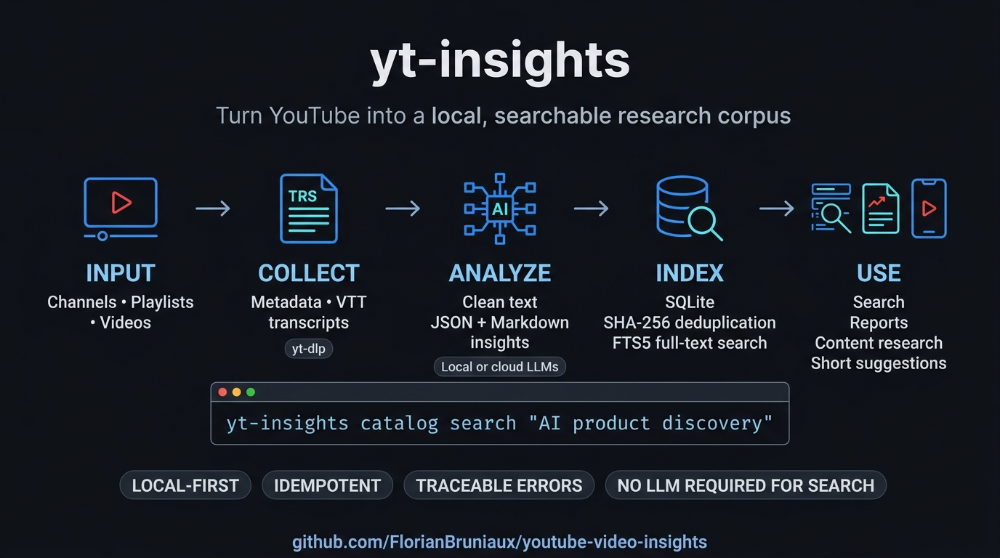
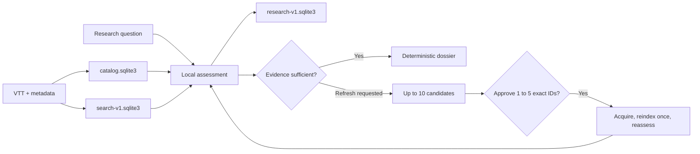

# yt-insights

[](https://www.python.org/)
[](LICENSE)

Turn YouTube into a cumulative local research corpus: transcripts, structured
insights, SQLite/FTS5 search, resumable research sessions, deterministic
evidence dossiers, reports, Shorts, and read-only MCP access for Claude Code or
Codex.

The current implementation checks local evidence first, reports coverage and
freshness, asks whether it is sufficient, and can discover new YouTube sources
only after that answer. Acquisition remains a second explicit decision: at
most ten candidates are presented and only one to five exact approved IDs can
be acquired. See the
[implementation status, diagram, and test guide](docs/IMPLEMENTATION-STATUS.md).



The image is retained as the stable acquisition overview. The current
cumulative-research architecture is also available as a reproducible
[Mermaid source](docs/assets/cumulative-research-workflow.mmd).

---

## Start here

| Goal | Command | Result |
|---|---|---|
| Check a local installation | `uv run yt-insights doctor --json` | Secret-safe dependency, corpus, index, catalog, and optional backend status |
| Preview an acquisition | `uv run yt-insights acquire URL --dry-run --json` | Selected videos and exclusions, with no corpus write |
| Acquire one channel | `uv run yt-insights acquire URL --slug NAME --yes` | VTT and metadata under the configured data root |
| Export one transcript | `uv run yt-insights export video VIDEO_ID --format md` | Sourced VTT, text, or timestamped Markdown |
| Analyze a channel | `uv run yt-insights run https://www.youtube.com/@ChannelName` | Transcripts, structured insights, and an aggregate report |
| Index an existing corpus | `uv run yt-insights catalog import-corpus ./output` | One deduplicated SQLite catalog with durable import errors |
| Build the timestamped search index | `uv run yt-insights index --all` | A derived FTS5 index over every VTT passage |
| Find a sourced passage | `uv run yt-insights search "AI product discovery"` | Ranked excerpts, timestamps, and direct YouTube links |
| Start cumulative research | `uv run yt-insights research start "AI product engineering workflows" --json` | A durable local assessment and a mandatory sufficiency question |
| Resume research | `uv run yt-insights research status SESSION_ID --json` | Revision, evidence, candidates, attempts, per-video outcomes, and required user action |
| Export an evidence dossier | `uv run yt-insights research export SESSION_ID --output /absolute/path --json` | Deterministic `dossier.md` and `manifest.json`, kept outside source indexes |
| Query from an LLM client | `uv run --extra mcp yt-insights-mcp` | Four read-only corpus, video, and passage tools |

Analysis uses a local or cloud LLM. Catalog import, transcript indexing, and
both search commands do not. Repeated runs reuse analysis caches and avoid
duplicating unchanged catalog artifacts.

Before the first cumulative session, acquire at least one source or import an
existing corpus, then build the timestamped index. A successful
`research start ... --json` returns a `session_id`, a `revision`, coverage and freshness,
plus `required_user_action=confirm_sufficiency_or_refresh`. It never contacts
YouTube.

---

## What it's actually for

Point it at a YouTube channel to keep the VTT sources locally, generate one
structured insight file per video, and build an aggregate report across the
channel. The same VTT corpus can be indexed as timestamped passages, searched
from the CLI, or queried by an LLM through MCP while preserving the source link.

The Shorts pipeline uses those transcripts to score the top three moments per
video, with verbatim text and precise timestamps. After you choose one,
`yt-dlp` downloads that segment instead of the full video.

Use it for content research, competitive monitoring, editorial analysis, or
building a searchable source library across several channels. Deterministic
exports in VTT, text, or Markdown can feed an article, a RAG pipeline, or a
dataset without asking an LLM to rewrite the source.

yt-insights uses subtitles already exposed as VTT by YouTube. It does not
download audio for transcription. Audio transcription remains outside the
runtime because it would add media downloads, compute cost, and a second text
source without a demonstrated missing-subtitle use case.

---

## How it works

### Four local data layers

| Layer | Purpose | Mutation boundary |
|---|---|---|
| VTT and metadata files | Immutable source text, timestamps, and YouTube identity | Added only by explicit acquisition |
| `catalog.sqlite3` | Inventory, memberships, artifacts, import runs, and durable errors | Rebuilt and atomically published from source files |
| `.search/search-v1.sqlite3` | Derived FTS5 passages with timestamped YouTube URLs | Rebuilt and atomically published from VTT files |
| `.research/research-v1.sqlite3` | Sessions, assessments, decisions, candidates, attempts, and events | Updated by the `research` state machine |

`dossier.md` and `manifest.json` are deterministic publications, not a fifth
source layer. They never enter the catalogue or FTS index.



<details>
<summary>Insight pipeline</summary>

```
YouTube URL / channel
        │
        ▼
   yt-dlp (subprocess)          Downloads auto-generated subtitles
        │
        ▼
   output/transcripts/*.vtt
        │
        ▼
   cleaner.py                   Deduplicates lines, strips timestamps
        │                       and HTML tags from VTT format
        ▼
   analyzer.py ─────────────►  LLM backend
   ThreadPoolExecutor           cc-bridge │ Ollama │ MLX │ Anthropic API
   (3× remote, 1× local)        OpenAI-compatible endpoint supported
        │
        ├──► output/insights/<video>.json   ← source of truth (atomic write)
        └──► output/insights/<video>.md     ← rendered from JSON
                │
                ▼
        reporter.py
        Counter (top tools, no LLM)
        + one LLM call for narrative synthesis
                │
                ▼
        AGGREGATE_REPORT.md + .json
```

</details>

<details>
<summary>Shorts suggestion pipeline</summary>

```
output/transcripts/*.vtt
        │
        ▼
   vtt_parser.py                Timestamped dedup: first-occurrence tracking
        │                       strips inline <c> tags, rolling caption dedup
        ▼
   [HH:MM:SS] text segments
        │
        ▼
   shorts.py ──────────────►   LLM backend (same auto-detection)
   ThreadPoolExecutor           Identifies top 3 moments (30-90s) per talk:
                                hook, score/5, verbatim, timestamps
        │
        ├──► output/shorts/<video>.json   ← suggestion cache (atomic write)
        ├──► output/shorts/<video>.md     ← human-readable suggestions
        └──► output/shorts/INDEX.md       ← global index sorted by score
                                         across all talks
        │ (optional phase 2)
        ▼
   generate-short command
   yt-dlp --download-sections   Downloads only the segment (~20-50MB,
                                not the full video)
        │
        ▼
   output/clips/<title>.mp4
```

</details>

<details>
<summary>Key design decisions</summary>

- yt-dlp runs as a subprocess, never imported as a library (subprocess is the stable contract)
- `stop_reason == "max_tokens"` gates writes: truncated responses are never cached, retried on next run
- Insight and Shorts generation send at most 10,000 transcript characters per LLM call. The CLI reports `USED/TOTAL` before each real call and marks truncation without printing transcript content. Cache hits do not call the model or print this line. The full timestamped VTT remains available to the FTS index; long-form LLM analysis is not chunked yet.
- `ThreadPoolExecutor` over asyncio: `httpx.Client` is thread-safe, no event loop needed
- YouTube VTT rolling captions repeat each phrase 2-3x as it scrolls; `vtt_parser.py` tracks first occurrence per unique text fragment, giving clean timestamped segments

</details>

---

## Prerequisites

- Python 3.11 or later
- [yt-dlp](https://github.com/yt-dlp/yt-dlp) installed in PATH (`brew install yt-dlp` or `pip install yt-dlp`)
- At least one LLM backend (see [Backends](#backends))

---

## Installation

The project is not published on PyPI. Install the checked-out source with
[uv](https://docs.astral.sh/uv/):

```bash
git clone https://github.com/FlorianBruniaux/youtube-video-insights
cd youtube-video-insights
uv sync --extra dev
uv run yt-insights --help
```

Add the optional MCP server when a local LLM client needs to query the index:

```bash
uv sync --extra mcp --extra dev
```

The versioned `uv.lock` fixes the complete application environment. See
[INSTALL.md](INSTALL.md) for a standard `venv` and editable-install alternative.

For a machine with no local LLM (no Ollama, no GPU), see [INSTALL.md](INSTALL.md): it covers every backend option step by step (Anthropic API key, Ollama, cc-bridge, any other OpenAI-compatible provider).

---

## Quick start

```bash
# Use one absolute corpus from any working directory
export YT_INSIGHTS_DATA_ROOT="$HOME/Library/Application Support/yt-insights/corpus"

# Validate the local runtime without changing the corpus or calling an LLM
uv run yt-insights doctor --json

# Preview first. Channel, playlist, and batch acquisition require --yes.
uv run yt-insights acquire https://www.youtube.com/@DevWithAIYoutube --dry-run --json
uv run yt-insights acquire https://www.youtube.com/@DevWithAIYoutube --slug dev-with-ai --yes

# Export source material without an LLM
uv run yt-insights export video VIDEO_ID --format md

# Full pipeline: download subtitles + analyze + aggregate report
uv run yt-insights run https://www.youtube.com/@DevWithAIYoutube

# Re-analyze existing VTT files (no download)
uv run yt-insights run https://www.youtube.com/@DevWithAIYoutube --skip-download

# Regenerate the aggregate report only
uv run yt-insights report

# Suggest Shorts from all existing VTT files
uv run yt-insights suggest-shorts

# Suggest Shorts for a single talk
uv run yt-insights suggest-shorts --vtt output/transcripts/20260423-talk.vtt

# Regenerate the global Shorts index (no LLM call)
uv run yt-insights suggest-shorts --index-only

# Download a specific clip segment (no full-video download)
uv run yt-insights generate-short VIDEO_ID --start 00:05:10 --end 00:05:55 --title "hook-context-engineering"
```

Expected output, with paths shortened to keep the example readable:

```
Resolved backend: backend=ollama endpoint=http://127.0.0.1:11434/v1 model=qwen3:8b
Downloading subtitles from https://www.youtube.com/@DevWithAIYoutube ...
  47 subtitle file(s) downloaded.

Analyzing 47 video(s) with model 'qwen3:8b' ...
Transcript input: 10000/45678 characters (truncated)
  47 insight(s) generated:
    output/insights/<video>.md

Generating aggregate report ...
Resolved backend: backend=ollama endpoint=http://127.0.0.1:11434/v1 model=qwen3:8b
  Aggregate  → output/insights/AGGREGATE_REPORT.md
  Full       → output/insights/FULL_REPORT.md
Done.
```

`data_root` resolves in this order: command override where available,
`YT_INSIGHTS_DATA_ROOT`, `~/.config/yt-insights/config.toml`, then `output`
relative to the current directory. Configure an absolute TOML or environment
path for use from Claude Code, Codex, cron, or unrelated repositories. Explicit
`--corpus-root` and `--database` values on index/search commands override the
derived paths for that invocation.

Set an optional absolute `research_output_root` in the same TOML file, or use
`YT_INSIGHTS_RESEARCH_OUTPUT_ROOT`, to publish canonical dossiers. Without it,
`research export` requires an explicit absolute `--output`.

`acquire` downloads subtitles and metadata. It calls no LLM unless `--analyze`
is present. A channel, playlist, or batch file exits with code 3 before download
unless `--yes` is supplied; `--dry-run` always stops before corpus writes. A
single-video URL does not need `--yes`.

`export video` accepts an exact video ID or supported YouTube URL. `vtt` copies
the source bytes, `txt` emits cleaned transcript text, and `md` includes source
identity, language, canonical URL, SHA-256, and timestamped passages. The
default destination is `<data_root>/exports`; `--output` selects one file and
`--force` is required to replace it.

## Local watch catalog (SQLite)

The catalog commands turn existing outputs or newly discovered video lists into
one local, searchable database. They do not require an LLM.

```bash
# Import an existing multi-channel corpus without modifying its files
yt-insights catalog import-corpus \
  ./output

# Discover the current videos exposed by a channel/playlist through yt-dlp
yt-insights catalog discover \
  https://www.youtube.com/@PragmaticEngineer/videos

# Search title, source, insight text, and cleaned transcripts
yt-insights catalog search "AI product discovery"
yt-insights catalog search "Martin Fowler" --source pragmaticengineer --limit 5

# Inspect stable counts and every persisted collection/import error
yt-insights catalog stats
yt-insights catalog errors
yt-insights catalog errors --run-id 3
```

The default database is `output/catalog.sqlite3` (gitignored). Override it on
any catalog command with `--db PATH`. Canonical videos are unique by YouTube
video ID. Source membership and French/English artifacts remain separate, while
identical artifacts collapse by SHA-256. Every command is safe to rerun: a
second corpus import creates a new audit run but no duplicate video or artifact.

An import continues after malformed files and reports `status=partial`; use
`catalog errors` to see the exact paths and diagnostics. JSON files with the
expected keys but invalid value types are retained for search and explicitly
logged as validation errors.

`catalog discover` currently reuses the repository's unofficial `yt-dlp`
collector. Treat this as a local experimental adapter, not a compliance claim.
For a public or commercial service, review YouTube's Terms and prefer the
official YouTube Data API for search and metadata. The detailed source trade-offs
and phased architecture are in
[`docs/superpowers/specs/2026-08-26-youtube-newsletter-watch-design.md`](docs/superpowers/specs/2026-08-26-youtube-newsletter-watch-design.md).

---

## Local transcript search

The default command indexes a deterministic 50-file slice for quick validation.
Use `--all` to build the full local corpus index. Neither mode sends transcripts
to an LLM or a remote service.

```bash
# Inspect the first deterministic 50-file slice without creating a database
yt-insights index --dry-run

# Build the derived local FTS index (default: output/.search/search-v1.sqlite3)
yt-insights index

# Build the complete corpus index after a disk-space preflight
yt-insights index --all

# Build a more diverse 50-file evaluation slice
yt-insights index --selection representative

# Validate the existing index without scanning transcripts
yt-insights index --status

# Search passages, optionally narrowed to one channel or language
yt-insights search "reliable agents" --channel my-channel --lang en

# Same ranked results as deterministic JSON
yt-insights search "reliable agents" --json
```

Use `--corpus-root`, `--database`, and `--limit` to point at a local corpus or a
derived index. `index --limit` accepts only 1 through 50 in slice mode;
`search --limit` accepts 1 through 20. The VTT corpus remains read-only and the
SQLite database can be rebuilt at any time.

### Prepare a relevance review packet

Copy the tracked template, replace every placeholder with real article subjects
and queries, then prepare a deterministic packet. The command records the Git
commit, observed loaded-source hashes, captured index hash, query-set hash,
ranked passages, timestamps, and source URLs. It never invents human judgments
and keeps the evaluation status `UNKNOWN`.

```bash
cp plans/evidence/2026-08-30-p2-query-template.json /tmp/p2-queries.json
uv run python scripts/prepare_search_relevance_evaluation.py \
  --database /ABSOLUTE/PATH/TO/search-v1.sqlite3 \
  --queries-file /tmp/p2-queries.json \
  --output /tmp/p2-evaluation-packet.json \
  --commit-sha "$(git rev-parse HEAD)" \
  --top-k 10
```

The unedited template is rejected intentionally. See the
[P2 evaluation protocol](plans/evidence/2026-08-28-p2-50-vtt-evaluation.md)
for the 20-result pilot, the 60-to-100-case release gate, and human-review rules.

### MCP access for local LLM clients

Install the `mcp` extra, build an index, then configure the stdio command in the
LLM client:

```bash
uv sync --extra mcp --extra dev
uv run yt-insights index --all
uv run yt-insights catalog import-corpus "$YT_INSIGHTS_DATA_ROOT"
```

```json
{
  "mcpServers": {
    "yt-insights": {
      "command": "uv",
      "args": ["run", "yt-insights-mcp"],
      "cwd": "/absolute/path/to/youtube-video-insights",
      "env": {
        "YT_INSIGHTS_SEARCH_DATABASE": "/absolute/corpus/.search/search-v1.sqlite3",
        "YT_INSIGHTS_CATALOG_DATABASE": "/absolute/corpus/catalog.sqlite3"
      }
    }
  }
}
```

The server exposes exactly four read-only tools in this order:
`list_corpora`, `search_videos`, `search_passages`, and `get_passage`. Set both
database variables to absolute paths for a client launched outside the repo.
When one is absent, the server derives it from the configured `data_root`.

---

## Supported sources

| Source type | Example |
|---|---|
| YouTube channel | `https://www.youtube.com/@DevWithAIYoutube` |
| YouTube channel (videos tab) | `https://www.youtube.com/@DevWithAIYoutube/videos` |
| Playlist | `https://www.youtube.com/playlist?list=PLxxx` |
| Single video | `https://www.youtube.com/watch?v=dQw4w9WgXcQ` |

Any URL accepted by yt-dlp works as SOURCE.

---

## Backends

Use `--backend` or `YT_INSIGHTS_BACKEND` when the execution target matters.
Accepted values are `auto`, `ollama`, `mlx`, `cc-bridge`, `anthropic`, and
`openai`. The same option is available on `run`, `report`, `suggest-shorts`,
and `acquire --analyze`.

| Explicit backend | Required configuration | Runtime behavior |
|---|---|---|
| `ollama` | Optional exact `--model`; optional `--base-url http://HOST:11434/v1` | Verifies the model against `/api/tags`; one local worker |
| `mlx` | Exact MLX model name and the `mlx` extra | Loads model and tokenizer lazily in-process; one local worker |
| `cc-bridge` | Local service on port 4141 | Requires a healthy endpoint and a usable completion route |
| `anthropic` | `ANTHROPIC_API_KEY` | Uses only an Anthropic-scoped key |
| `openai` | Explicit `--base-url`, model, and provider key | Calls the named OpenAI-compatible endpoint |

An explicit backend never silently changes provider. `auto` keeps the existing
local-first detection order. Within `auto`, an Explicit endpoint supplied by
`--base-url` or `YT_INSIGHTS_BASE_URL` remains Priority 0 and is selected before
any localhost probe. It short-circuits every automatic probe.

| Priority | Backend | How to activate | Model format |
|---|---|---|---|
| 0 | Explicit endpoint | Set `--base-url` or `YT_INSIGHTS_BASE_URL` | provider-specific |

Automatic detection order when no endpoint was configured:

| Priority | Backend | How to activate | Model format |
|---|---|---|---|
| 1 | cc-bridge | Start cc-bridge on port 4141 | `anthropic/github_copilot/gpt-5-mini` |
| 2 | Ollama | `ollama serve` | exact requested model, or automatic local selection |
| 3 | Anthropic API | `export ANTHROPIC_API_KEY=sk-...` | `claude-haiku-4-5` |

Backend selection matters only for `run`, `report`, `suggest-shorts`, or
`acquire --analyze`. Acquisition without analysis, indexing, search, export,
and MCP use no LLM. Override model and endpoint via flags:

```bash
yt-insights run <url> --model claude-sonnet-4-6 --base-url https://api.anthropic.com/v1
```

After Ollama has been selected, an explicit `--model` or `YT_INSIGHTS_MODEL`
must match an installed model exactly. If it is missing, the CLI lists the
available names and the corresponding `ollama pull` command. Automatic local
selection happens only when no model was requested. Use both
`--base-url http://127.0.0.1:11434/v1` and `--model` to force Ollama. `--model`
alone keeps the normal detection order, including cc-bridge before Ollama.

**cc-bridge model ID gotcha**: use the gateway format `anthropic/{provider}/{model}` (e.g. `anthropic/github_copilot/gpt-5-mini`) to route directly to the named provider via cc-bridge's stored credentials. A plain model ID (e.g. `claude-haiku-4-5`) uses cc-bridge's `active_route`. The probe requires `/health` to return 200 and the minimal completion to return 2xx or 3xx. A 4xx, 429, or 5xx response falls back to Ollama, then Anthropic when its API key is available.

Use `--backend cc-bridge` with the gateway model ID to force cc-bridge. Use
`--backend mlx --model mlx-community/Qwen3-4B` for direct MLX execution. MLX
selection is explicit because loading a local model is materially different
from probing an HTTP service.

---

## CLI reference

<details>
<summary>Show all commands and options</summary>

```
yt-insights run SOURCE [OPTIONS]

  SOURCE  YouTube channel, playlist, video URL, or local file with one URL per line.

  --skip-download           Skip yt-dlp, use existing VTT files in output/transcripts/
  --force                   Re-analyze even if insight cache exists
  --backend NAME            auto, ollama, mlx, cc-bridge, anthropic, or openai
  --model TEXT              Override LLM model
  --base-url TEXT           Override LLM API base URL
  --concurrency INTEGER     Max parallel LLM calls (0 = auto: 3 for API, 1 for Ollama)
  --output-dir PATH         Base directory for transcripts/ and insights/
  --sleep-requests INTEGER  Seconds to wait between yt-dlp requests (rate limiting)

yt-insights report [OPTIONS]

  --output PATH    Output path (default: <insights_dir>/AGGREGATE_REPORT.md)
  --backend NAME
  --model TEXT
  --base-url TEXT

yt-insights suggest-shorts [OPTIONS]

  Identify the top 3 Short-worthy moments (30-90s) in each VTT transcript.
  LLM criteria: autonomous hook, punchy verbatim, clean in/out points, score 1-5.
  Skips already-processed talks unless --force is set.

  --vtt PATH         Process a single VTT file instead of the full transcripts dir
  --force            Re-analyze even if suggestion cache exists
  --index-only       Regenerate INDEX.md only, no LLM calls
  --backend NAME     Select the LLM execution target
  --model TEXT       Override LLM model
  --base-url TEXT    Override LLM API base URL
  --output-dir PATH  Base output directory (default: output/)

yt-insights generate-short VIDEO_ID [OPTIONS]

  Download a single clip segment from YouTube using yt-dlp --download-sections.
  Only the requested range is fetched (~20-50MB), not the full video.

  --start TEXT       Start timestamp HH:MM:SS  [required]
  --end TEXT         End timestamp HH:MM:SS  [required]
  --title TEXT       Short title for output filename
  --output-dir PATH  Directory for clip output (default: output/clips/)
  --output-format TEXT  Container format: mp4, webm, or mkv

yt-insights config show [OPTIONS]

  Print effective values and sources without probing or resolving a backend.
  Endpoint diagnostics remove URL credentials, query strings, and fragments.
  Accepts --backend, --model, and --base-url to simulate overrides before running.

yt-insights config init

  Create ~/.config/yt-insights/config.toml with all defaults commented.

yt-insights doctor [--json] [--probe-backends]

  Inspect dependencies and local corpus state without writes or completion calls.
  Backend probes, when requested, are limited to localhost cc-bridge and Ollama.

yt-insights acquire SOURCE [--dry-run] [--yes] [--slug NAME] [--years LIST]

  Preview or acquire a video, channel, playlist, or bounded batch file.
  Channel, playlist, and batch execution require --yes.

yt-insights export video VIDEO_OR_URL [--format vtt|txt|md] [--lang CODE]

  Export one source transcript. Existing targets require --force.

yt-insights index [--dry-run|--status|--all]

  Build or validate the timestamped SQLite transcript index.

yt-insights search QUERY [--channel ID] [--lang CODE] [--limit 1..20] [--json]

  Search timestamped passages in the derived transcript index.

yt-insights research start TOPIC [--query QUERY]... [--freshness-profile PROFILE] [--json]
yt-insights research status SESSION_ID [--json]
yt-insights research decide SESSION_ID sufficient|refresh --revision N --idempotency-key KEY [--json]

  Assess local evidence, resume a durable session with structured acquisition
  history, and record the mandatory sufficiency decision. Status includes
  attempt ID, status, per-video error code, and source SHA-256 when available.
  `refresh` authorizes discovery, not acquisition.

yt-insights research discover SESSION_ID --revision N [--json]
yt-insights research candidates SESSION_ID [--json]
yt-insights research approve SESSION_ID VIDEO_ID... --revision N --idempotency-key KEY [--json]
yt-insights research acquire SESSION_ID --revision N --idempotency-key KEY [--json]

  Present at most ten candidates, then acquire only one to five exact IDs
  selected by the user. Refresh the indexes once and assess the corpus again.

yt-insights research retry SESSION_ID --revision N --idempotency-key KEY [--json]
yt-insights research cancel SESSION_ID --revision N --idempotency-key KEY [--json]
yt-insights research export SESSION_ID [--output DIRECTORY] [--force] [--json]

  Retry only the recorded failed stage, preserve successful per-video outcomes
  without reacquiring them, cancel candidate review, or publish a deterministic
  evidence dossier.
```

</details>

---

## Output structure

<details>
<summary>Show directory layout and example files</summary>

```
output/
  transcripts/
    20260101 - Video Title [videoID].fr.vtt   # raw subtitles
    20260101 - Video Title [videoID].info.json # channel metadata sidecar
  insights/
    20260101 - Video Title [videoID].fr.json  # source of truth
    20260101 - Video Title [videoID].fr.md    # rendered from JSON
    AGGREGATE_REPORT.md                       # narrative synthesis
    AGGREGATE_REPORT.json                     # top tools + per-video index
  shorts/
    20260101 - Video Title [videoID].fr.json  # suggestion cache
    20260101 - Video Title [videoID].fr.md    # timestamps, hook, score, verbatim
    INDEX.md                                  # table sorted across talks
  clips/
    talk-title_000510.mp4                     # downloaded segment
  exports/
    VIDEO_ID.en.md                            # sourced, timestamped transcript export
  catalog.sqlite3                             # inventory database
  .search/search-v1.sqlite3                   # timestamped passage index
  .research/research-v1.sqlite3               # durable research sessions
```

When `research_output_root` is configured, dossiers use
`<root>/<topic-slug>/<YYYY-MM-DD>-<session-id>/`. An explicit `--output`
supports a safe copy into another project. Dossiers are never indexed as
YouTube evidence.

Full-channel automation may place the same `transcripts/`, `insights/`, and
`shorts/` subdirectories under `output/<channel-slug>/`. The corpus scanner
supports both layouts. Flat layouts require the adjacent `.info.json` sidecar
to preserve channel identity.

Example `output/shorts/video.md` entry:

```markdown
## Short 1 - Score : 5/5

**Timestamps :** 00:05:10 -> 00:05:48 (38s)
**Lien direct :** https://youtube.com/watch?v=VIDEO_ID&t=310s
**Hook :** L'IA ne remplace pas le dev, elle remplace le flou
**Rationale :** Formule autonome, tension forte, borne nette sur une chute.

> "Le vrai problème c'est pas le code, c'est la spec. Et ça, l'IA ne peut pas
> l'inventer à votre place."
```

Example `video.json`:

```json
{
  "subject": "How to run local LLMs on consumer hardware",
  "key_points": [
    "RAM and VRAM constraints determine which models are viable",
    "Quantisation (4-bit/8-bit) cuts memory use with minimal quality loss",
    "Instruction-tuned models outperform base models for chat/code tasks"
  ],
  "tools": [
    {"name": "Ollama", "context": "recommended runtime for local deployment"},
    {"name": "Hugging Face", "context": "source for model cards and downloads"}
  ],
  "advice": [
    "Check your VRAM first, then pick the largest model that fits",
    "Read the model card before downloading (usage restrictions vary)"
  ],
  "quotes": [
    "The best model is the one that actually runs on your machine."
  ]
}
```

</details>

---

## Idempotence

Every run is idempotent. If `video.json` already exists for a given VTT file, it is loaded from disk with no LLM call. Interrupt the process at any point: partial runs leave `.tmp.json` orphans at worst, never a corrupt `.json`.

Re-process everything from scratch:

```bash
yt-insights run <url> --force
```

---

## Insight JSON schema

<details>
<summary>Show schema</summary>

The LLM is always instructed to return exactly this structure:

```
subject      string        One-sentence description of the video topic
key_points   string[]      3-5 main points covered
tools        object[]      {name, context}: tools and technologies mentioned
advice       string[]      Immediately actionable recommendations
quotes       string[]      Notable quotes (empty array if none)
```

</details>

---

## Configuration file

```bash
yt-insights config init  # creates ~/.config/yt-insights/config.toml
```

All keys are optional. CLI flags and `YT_INSIGHTS_*` env vars take precedence over the file.

---

## Feature summary

| Feature | Detail |
|---|---|
| Subtitle download | yt-dlp subprocess, any URL it accepts |
| VTT cleaning | Dedup, strip timestamps, HTML tags, `[Musique]` annotations |
| Insight extraction | 5-key JSON schema: subject, key_points, tools, advice, quotes |
| Atomic writes | `.tmp.json` → `os.replace()`, no corrupt files on Ctrl-C |
| Truncation guard | `stop_reason == "max_tokens"` → skip cache, retry next run |
| Caching | Cache hit = zero LLM calls, `--force` to override |
| Concurrency | 3 threads for remote APIs, 1 for Ollama or MLX (auto-tuned) |
| Backends | Explicit or automatic cc-bridge, Ollama, MLX, Anthropic, and OpenAI-compatible endpoints |
| Auto-detection | Backend probed at first LLM call, no config needed |
| Aggregate report | `Counter` top tools (no LLM) + one narrative LLM call |
| Config file | 4-layer merge: defaults → TOML → env vars → CLI flags |
| Idempotence | Re-run safely at any time, skips existing insights |
| Shorts suggestions | Top 3 moments per talk (30-90s), scored 1-5 by LLM, cross-talk INDEX.md |
| Timestamped VTT | First-occurrence dedup with timestamps preserved for Shorts pipeline |
| Clip download | `yt-dlp --download-sections`, segment only, no full-video fetch |
| Local catalog | SQLite storage for canonical videos, sources, transcripts, insights, runs, and errors |
| Full-text search | FTS5 across titles, sources, insight text, and cleaned transcripts |
| Timestamped passage index | Full VTT corpus in `search-v1.sqlite3`, with deterministic excerpts and YouTube links |
| Safe acquisition | Dry-run plan plus explicit confirmation for channel, playlist, and batch writes |
| Deterministic export | VTT, cleaned text, or sourced Markdown without an LLM |
| Runtime doctor | Secret-safe, no-write diagnostics with optional localhost-only probes |
| MCP access | Exactly four read-only corpus, video, search, and passage tools |
| Cumulative research | Catalogue-first coverage and freshness assessment with durable resume |
| Human approval boundaries | Mandatory sufficiency question, then a separate exact-ID acquisition decision |
| Research limits | At most 10 candidates and 5 approved acquisitions per cycle |
| Evidence dossier | Deterministic Markdown and JSON manifest, separate from source indexes |
| Index integrity | Generation receipt bound to the database SHA-256; cached validation invalidated by file identity and `ctime` |
| Backend identity | CLI reports the resolved backend, endpoint, and exact model without exposing URL credentials |
| LLM input visibility | CLI reports used and total transcript characters before each real generation call |

---

## For AI coding assistants

Load [`llms.txt`](llms.txt) for the tracked, machine-readable project snapshot:
commands, modules, storage model, invariants, generated data, and current gaps.
The architecture rationale and implementation sequence live under
[`docs/superpowers/`](docs/superpowers/).
The [implementation status](docs/IMPLEMENTATION-STATUS.md) separates delivered
features, conditional work, and reproducible validation commands.

### Portable agent integration status

The repository includes four portable skills, `youtube-acquire`,
`youtube-research`, `youtube-export`, and `youtube-cumulative-research`, plus a
read-only corpus researcher for Claude Code and Codex. The cumulative skill
runs in the main session because discovery and approved acquisition may use the
network and write source files. All four delegate to the packaged CLI or
read-only MCP.

Invoke the skills explicitly. The disjoint routing evaluation rejected the
implicit BM25 hook because every generalizable calibration left either missed
requests or forbidden activations.

On the development workstation, the older digest-approved shared release
`60cbcac…` contains three skills. The fourth cumulative skill exists in this
repository and in the wheel candidate, but it has not been installed globally.
Fresh Claude Code and Codex canaries for this workflow remain `UNKNOWN` and
`global_activation_ready` is `false`.

The setup command previews by default, refuses different existing files, and
rolls back newly created state if one client registration fails:

```bash
uv run --extra mcp yt-insights setup assistants \
  --client both \
  --data-root "$YT_INSIGHTS_DATA_ROOT" \
  --dry-run

uv run --extra mcp yt-insights setup assistants \
  --client both \
  --data-root "$YT_INSIGHTS_DATA_ROOT" \
  --apply

uv run --extra mcp yt-insights setup assistants \
  --client both \
  --data-root "$YT_INSIGHTS_DATA_ROOT" \
  --verify
```

Install or upgrade only repository skills and native agent files without
reading or changing existing MCP registrations with:

```bash
uv run yt-insights setup assistants --client both --assets-only --dry-run
uv run yt-insights setup assistants --client both --assets-only --apply
uv run yt-insights setup assistants --client both --assets-only --verify
```

`--apply` changes the user-level Claude Code and Codex configuration. Cloning,
installing, or running the default preview changes nothing globally. The
development workstation has not applied this new four-skill transaction. Live
YouTube research and fresh Claude Code and Codex workflow canaries remain
`UNKNOWN`.

| Document | Purpose |
|---|---|
| [Current Claude Code and Codex guide](docs/claude-code.md) | Supported skills, four MCP tools, local commands and verified installation boundary |
| [Ready-to-copy assistant prompts](examples/agent-prompts.md) | Acquisition previews, cited research, article dossiers and deterministic exports |
| [Agent platform architecture](plans/specs/AGENT-PLATFORM.md) | Target behavior, data boundaries, skills, agents and safety rules |
| [Agent-ready runtime plan](plans/2026-08-28-09-agent-ready-runtime.md) | CLI, paths, backends, acquisition, export and MCP work |
| [Claude Code and Codex integration plan](plans/2026-08-28-10-claude-codex-global-integration.md) | Portable skills, native agents, routing evaluation and digest-bound global installation |
| [Hosted service and extension plan](plans/2026-08-28-11-hosted-extension.md) | Conditional browser and remote-access path |

The runtime plan passes the package smoke gate. Cloning or installing this
repository never changes global Claude Code or Codex configuration. Only
`setup assistants --apply` performs that scoped user-level installation.
Until a runtime transaction is approved and applied, use `uv run yt-insights`
and `uv run --extra mcp yt-insights-mcp` from this checkout.

---

## Claude Code integration

The five historical commands under `.claude/skills/` remain available only for
explicit compatibility calls. Their frontmatter blocks model-triggered
invocation so they do not compete with the portable skills.

Use the portable skills below for new workflows. The historical commands and
example remain as a compatibility reference.

### Agent

`youtube-corpus-researcher` is a read-only native agent for source-backed corpus
research. It uses `youtube-research` and the MCP, returns timestamped evidence,
and cannot acquire videos, rebuild indexes, or write exports. The historical
`yt-video-analyst` remains in the repository but is not the supported implicit
dispatcher.

### Skills

| Skill | What it does |
|---|---|
| `youtube-acquire` | Previews and acquires one video, playlist, or channel through the packaged CLI |
| `youtube-research` | Searches the local catalogue and timestamped passage index without writes |
| `youtube-export` | Exports an existing video as VTT, text, or sourced Markdown |
| `youtube-cumulative-research` | Assesses local evidence, asks before discovery and exact-ID acquisition, reassesses, then optionally exports a dossier |

Historical explicit-only compatibility commands:

| Command | What it does |
|---|---|
| `/yt-get-transcript` | Downloads the VTT, checks cache first, retries with browser cookies on 429 |
| `/yt-get-insights` | Runs insight analysis on an existing VTT, reads from cache when already processed |
| `/yt-get-shorts` | Suggests the top 3 Short moments, presents them for your choice, downloads the chosen clip |
| `/yt-run-pipeline` | Runs transcript, insights and Shorts selection in sequence for a single video |
| `/yt-add-channel` | Processes a channel into `output/<slug>/`, rebuilds the Markdown/YAML indexes, then refreshes the SQLite catalog |

### How it works

1. Invoke one of the four portable skills explicitly.
2. Acquisition runs `doctor`, then a dry-run preview before any multi-video write.
3. Research uses the four read-only MCP tools and returns timestamped sources.
4. Cumulative research asks whether local evidence is sufficient and keeps discovery separate from candidate approval.
5. Export uses existing corpus artifacts and performs no LLM call.
6. Historical Shorts commands remain explicit and download a clip only after confirmation.

Each skill respects the same idempotence as the CLI: a VTT already on disk is not re-downloaded, a cached insight JSON triggers no LLM call.

### Example session

Explicitly invoke the historical pipeline when you need its Shorts workflow:

```
You:   https://www.youtube.com/watch?v=nfupYzLjFGc

Agent: VIDEO_ID = nfupYzLjFGc
       Cache: no transcript, no insights, no shorts yet.
       What do you want? (transcript / insights / shorts / everything)

You:   everything

Agent: [/yt-get-transcript] → output/transcripts/1200-commits-600-PRs.fr.vtt (42KB)

       [/yt-get-insights]
       Subject: 7 months solo, 1200 commits, 600 PRs, 50 releases
       Key points: solo dev velocity, AI-assisted release pipeline, PR review automation...
       Notable quote: "Je pensais que l'IA allait coder à ma place. Elle m'a surtout appris à
       mieux découper le travail."

       [/yt-get-shorts]
       Option 1 | Score 5/5 | 00:00:56 → 00:01:45 (49s)
       Hook: "1 200 commits, 600 PRs en 7 mois, seul dev"
       Verbatim: "Les chiffres c'est 7 mois à peu près, 1 200 commits..."

       Option 2 | Score 5/5 | 00:03:47 → 00:04:47 (60s)
       Hook: "Une plateforme de zéro en 5 semaines, seul"
       Verbatim: "La première version était en prod au bout de 5 semaines..."

       Option 3 | Score 4/5 | 00:07:12 → 00:08:05 (53s)
       Hook: "L'IA ne code pas à ta place, elle t'oblige à mieux découper"
       Verbatim: "Ce que j'ai découvert c'est que le vrai gain..."

       Which option? (1/2/3 or custom timestamps)

You:   2

Agent: Downloading segment 00:03:47 → 00:04:47...
       Clip saved: output/clips/plateforme-5-semaines-seul_000347.mp4 (1.8MB)
```

Run the pipeline on any video, skip any step you have already done. The agent never re-downloads a cached file or re-runs an LLM call unless you ask it to.

---

## Contributing

Open a PR. No CLA is required. Run `uv sync --extra mcp --extra dev`, then the
following checks before submitting a change:

```bash
uv run --extra mcp --extra dev pytest -q
uv lock --check
git diff --check
```

---

## License

MIT
