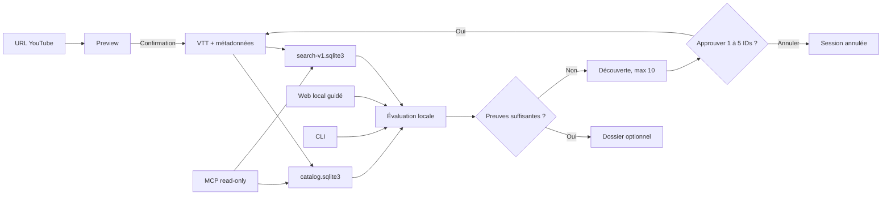

# Récapitulatif de livraison

**Mise à jour :** 2026-09-01

**Socle fonctionnel vérifié :** `b62adaaca6c4395a3622ac2d7b72d3efec1d353f`

**GitHub CI :** [`PASS`, run 33494963306](https://github.com/FlorianBruniaux/youtube-video-insights/actions/runs/33494963306)

YT Insights est passé d'un pipeline de transcription YouTube vers un corpus de
recherche local et cumulatif. Le produit conserve les VTT comme sources de
vérité, construit deux index SQLite spécialisés, orchestre des sessions de
recherche reprenables, puis expose le même socle par la CLI, une interface web
locale et un MCP en lecture seule.

## Capacités livrées

| Surface | Ce qui est disponible | Limite actuelle |
|---|---|---|
| Acquisition | Prévisualisation d'une vidéo, playlist, chaîne ou batch, puis téléchargement des VTT et métadonnées approuvés | Confirmation obligatoire pour les sources multiples; aucune transcription audio |
| Analyse | Insights structurés par vidéo, rapport agrégé et suggestions de Shorts | Appels LLM limités à 10 000 caractères de transcript par génération |
| Backends LLM | Ollama, MLX, cc-bridge, Anthropic et endpoints compatibles OpenAI | Le backend ne concerne ni le catalogue, ni FTS5, ni les exports déterministes |
| Catalogue | Inventaire SQLite des vidéos, appartenances, artefacts, imports et erreurs durables | `catalog.sqlite3` ne remplace pas l'index de passages |
| Recherche | Index FTS5 complet ou limité, extraits horodatés et liens YouTube directs | La pertinence humaine reste `UNKNOWN` |
| Recherche cumulative | Sessions persistées, couverture, fraîcheur, décisions, candidats, acquisitions, événements et retry borné | Le produit ne décide jamais que les preuves sont suffisantes |
| Découverte | Recherche YouTube par métadonnées après une décision `refresh` | Dix candidats au maximum, sans acquisition implicite |
| Approbation | Sélection séparée de un à cinq IDs exacts | Une révision obsolète ou une liste modifiée échoue sans mutation |
| Dossiers | `dossier.md` et `manifest.json` déterministes, avec sources et empreintes | Les dossiers ne sont jamais réindexés comme sources YouTube |
| Interface web | Dashboard, recherche, sources, sessions, décisions, jobs, timeline et exports en français et en anglais, avec détection et préférence persistante | Serveur local sur `127.0.0.1`, sans compte ni partage distant; le contenu du corpus garde sa langue source |
| API locale | API JSON versionnée `/api/v1`, token de mutation éphémère et jobs bornés | Même origine, pas de CORS ni d'exposition réseau |
| MCP | `list_corpora`, `search_videos`, `search_passages` et `get_passage` | Lecture seule, sans shell, SQL brut, acquisition ou export |
| Assistants | Quatre skills et chercheurs Claude Code/Codex packagés, prompts anglais et setup transactionnel | Le quatrième skill n'est pas activé globalement; le canari Claude Code reste `UNKNOWN` |
| Distribution | Wheel avec les assets Astro, installation et utilisation sans Node.js | Node.js et pnpm restent nécessaires pour contribuer au frontend |

## Parcours utilisateur

Le parcours quotidien peut rester simple:

1. acquérir une chaîne ou importer un corpus existant;
2. construire l'index FTS5;
3. rechercher depuis la CLI, le web ou un client MCP;
4. démarrer une session cumulative pour mesurer couverture et fraîcheur;
5. répondre à la question de suffisance;
6. si nécessaire, approuver de nouvelles sources puis relancer l'évaluation;
7. exporter un dossier sourcé vers le projet éditorial courant.

## Architecture de données

| Couche | Source | Usage |
|---|---|---|
| VTT et métadonnées | YouTube | Texte et timestamps de référence |
| `catalog.sqlite3` | Dérivé des fichiers locaux | Inventaire, provenance et erreurs |
| `.search/search-v1.sqlite3` | Dérivé des VTT | Passages FTS5 et liens horodatés |
| `.research/research-v1.sqlite3` | Produit par le workflow | Sessions, décisions, tentatives et événements |

Les publications `dossier.md` et `manifest.json` restent en dehors de ces
couches. Cette séparation empêche une synthèse générée de revenir comme preuve
source dans une recherche suivante.

## Fiabilité et sécurité ajoutées

- Écritures SQLite et artefacts publiés atomiquement.
- Révisions et clés d'idempotence sur chaque mutation de recherche.
- Reprise limitée au stage ou aux items réellement retryables.
- Validation des IDs, URLs, chemins, liens symboliques et tailles de requête.
- Serveur HTTP limité à loopback, avec contrôle du `Host`, CSP et token de
  mutation de même origine.
- Interface sans `innerHTML`, script distant, police distante, source map ou
  chemin privé de build.
- Build Astro reproduit depuis une copie temporaire des sources. Un plugin de
  build ne peut pas modifier le checkout.
- CI fail-closed sur les fichiers suivis et non suivis.
- Wheel testé depuis un environnement temporaire, en ligne puis hors ligne,
  sans runtime Node.js.

## Validation du 1er septembre 2026

| Gate | Résultat |
|---|---|
| Python | 1 089 tests plus 10 subtests |
| Frontend | 162 tests Vitest |
| Navigateur | 6 parcours Playwright |
| Astro | 57 fichiers, aucun diagnostic |
| Typage Python | Mypy sur 53 fichiers source |
| Lint | Ruff sur `src`, `tests` et `scripts` |
| Assets | 20 fichiers reconstruits et comparés |
| Packaging | Wheel minimal et MCP, smoke offline sans Node.js |
| GitHub Actions | Web, Python 3.11, Python 3.12, packaging et runtime `PASS` sur `b62adaa` |

Mypy a été exécuté avec `mypy src`, pas avec `--strict`. Ces gates ne prouvent
pas la pertinence éditoriale, un cycle YouTube live ni le chargement par une
session Claude Code fraîche.

## Ce qui reste à valider ou à construire

| Sujet | Statut | Prochaine preuve attendue |
|---|---|---|
| Pertinence humaine | `UNKNOWN` | Juger exactement 20 résultats et obtenir au moins 16 résultats acceptables |
| Cycle YouTube live final | `UNKNOWN` | Exécuter une acquisition réelle bornée et conserver son reçu |
| Claude Code frais | `UNKNOWN` | Charger le quatrième skill dans une session authentifiée et vérifier les deux confirmations |
| Activation globale | `false` | Préparer un candidat inerte, un digest, un rollback et obtenir l'approbation exacte |
| Interface hébergée | Non livrée | Confirmer le besoin après dix sessions locales utiles |
| Extension navigateur | Non livrée | Documenter dix frictions d'envoi manuel |
| Recherche vectorielle ou graphe | Non livrée | Montrer des questions réelles que FTS5 et les métadonnées ne résolvent pas |

La [roadmap](../ROADMAP.md) reste l'autorité pour l'ordre et les déclencheurs.
Le [statut d'implémentation](IMPLEMENTATION-STATUS.md) contient les commandes de
test, et le [guide d'installation](../INSTALL.md) couvre le lancement local et
la connexion Claude Code/Codex.
