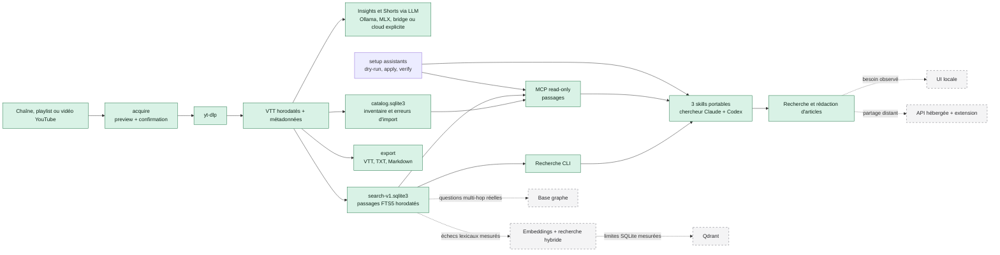

# État d'implémentation

- **Mise à jour :** 2026-08-30
- **Socle fonctionnel :** branche `main`; setup assistants ajouté dans le lot courant
- **Validation locale :** 567 tests et 10 sous-tests réussis
- **Wheel :** installation minimale et extra MCP validés hors checkout, offline
- **Source globale :** fast-forward approuvé de `e760a81` vers `62aa9ca`, puis 144 tests réussis
- **Release partagée :** `60cbcac…` active via la transaction `shared-cbd58f0a09d9-64a8fa11-a6a4-4d3f-a114-f87e188e1153`; check live `issues: []`
- **Canaris assistants :** Codex frais voit les trois skills YouTube; Claude reste `UNKNOWN` car son CLI local n'est pas connecté
- **Routage implicite :** `FAIL`; le meilleur candidat disjoint atteint 30/30 positifs et 0 confusion, mais déclenche encore 5/15 requêtes interdites

YT Insights sait maintenant collecter des sous-titres YouTube, produire des
analyses avec un LLM, indexer tous les passages horodatés dans SQLite et rendre
cet index interrogeable depuis la CLI ou un client MCP.

## Vue d'ensemble

Les blocs pleins sont implémentés. Les blocs en pointillés restent
conditionnels ou non commencés.



## Ce qui est utilisable maintenant

| Surface | Usage | État vérifié |
|---|---|---|
| Collecte | Prévisualiser puis acquérir une vidéo, chaîne ou playlist | `acquire`; confirmation obligatoire pour les lots |
| Analyse | Produire insights, conseils, outils, citations et rapport agrégé | Choix explicite ou automatique entre cc-bridge, Ollama, MLX, Anthropic et endpoint compatible |
| Shorts | Identifier trois passages et télécharger le segment choisi | Implémenté |
| Catalogue | Inventorier vidéos, sources, artefacts et erreurs d'import | Schéma portable v2, lecteurs immuables et writer copy-on-write dans `catalog.sqlite3` |
| Recherche de passages | Retrouver un extrait VTT, son timestamp et son lien YouTube | Implémenté dans `search-v1.sqlite3` |
| Préparation de revue | Produire un packet déterministe de résultats sourcés sans inventer de jugement | Script et template versionnés; statut maintenu à `UNKNOWN` jusqu'à revue humaine |
| Export | Produire un VTT, TXT ou Markdown sourcé sans LLM | `export video`, publication atomique |
| Diagnostic | Vérifier dépendances, chemins et backends locaux sans secret ni écriture | `doctor --json` |
| Accès LLM | Interroger catalogue et passages depuis un client MCP | Quatre outils read-only implémentés |
| Corpus complet | Construire l'index de tous les VTT après contrôle disque | Candidat temporaire v2: 3 270 documents, 183 789 passages, corpus réel inchangé |
| Installation | Installer le checkout, l'extra MCP et les assistants | Wheel 0.2.0 testé hors checkout; setup transactionnel testé avec HOME et clients factices |
| Assistants | Acquérir, rechercher et exporter depuis Claude Code ou Codex | Trois skills globaux découverts par un canari Codex frais; projection Claude présente, canari bloqué par l'authentification locale |

`catalog.sqlite3` et `search-v1.sqlite3` répondent à deux besoins différents.
Le catalogue conserve l'inventaire opérationnel. L'index de recherche dérive
directement des VTT et conserve les passages horodatés. Aucun des deux ne doit
être utilisé comme substitut aux fichiers source.

## Ce qui reste à décider ou implémenter

| Évolution | Pourquoi elle n'est pas active | Gate avant développement |
|---|---|---|
| Revue humaine de la pertinence | Le packet peut être préparé, mais la qualité éditoriale n'est pas jugée | Remplacer les placeholders par des sujets réels, préparer le packet puis enregistrer les jugements humains |
| Routage implicite Claude Code/Codex | Les calibrations disjointes conservent des faux positifs ou perdent des requêtes légitimes | Nouveau mécanisme seulement si un besoin d'invocation implicite est démontré; les skills explicites sont utilisables maintenant |
| Application globale | La source `62aa9ca`, la release partagée `60cbcac…` et le setup local sont prêts | Capturer les préimages live, approuver le digest, appliquer le runtime puis `setup assistants --apply`; reconnecter Claude avant son canari |
| Découpage LLM des longs transcripts | Insights et Shorts utilisent actuellement les 10 000 premiers caractères | Mesurer les pertes sur des articles réels, puis définir chunking et fusion |
| Canari MLX réel | Le routage et le chargement paresseux sont testés sans allocation de modèle | Exécuter une génération courte avec un modèle MLX installé sur la machine cible |
| UI locale | CLI et MCP couvrent déjà la recherche locale | Documenter une friction répétée lors de recherches réelles |
| Extension YouTube | Elle ajoute maintenance, permissions navigateur et sécurité | Confirmer qu'un envoi manuel par CLI ou MCP ralentit l'usage |
| Version hébergée | Elle impose authentification, isolation des corpus et exploitation | Besoin explicite de partage distant ou multi-utilisateur |
| Embeddings et recherche hybride | FTS5 suffit techniquement au corpus actuel | Mesurer des échecs sur synonymes, paraphrases ou recherche bilingue |
| Base graphe | Aucun besoin multi-hop n'est encore décrit par un cas réel | Nommer les questions impossibles à résoudre par passages et filtres |
| Qdrant | SQLite reste sous les budgets actuels | Adopter d'abord les embeddings, puis mesurer une limite de SQLite |

## Comment tester

### 1. Suite automatisée

Cette vérification ne contacte ni YouTube ni un LLM.

```bash
uv sync --extra mcp --extra dev
uv run --extra mcp --extra dev pytest -q
uv lock --check
git diff --check
```

Résultat observé le 30 août 2026 sur la branche de travail : `567 passed, 10 subtests passed`.

### 2. Tranche locale de 50 VTT

```bash
uv run yt-insights index --dry-run
uv run yt-insights index \
  --selection representative \
  --database /tmp/yt-insights-slice.sqlite3
uv run yt-insights search "context engineering" \
  --database /tmp/yt-insights-slice.sqlite3 \
  --limit 5
```

La première commande ne crée aucun fichier. Les deux suivantes construisent un
index dérivé dans `/tmp`, puis affichent des passages avec timestamps et liens
YouTube.

### 3. Corpus complet et benchmark

```bash
uv run yt-insights index \
  --corpus-root output \
  --database /tmp/yt-insights-full.sqlite3 \
  --all
uv run yt-insights index \
  --database /tmp/yt-insights-full.sqlite3 \
  --status
uv run python scripts/benchmark_search.py \
  --database /tmp/yt-insights-full.sqlite3 \
  --warmup 1 \
  --repeats 20 \
  --limit 10
```

La mesure de référence sur la machine de développement est un build en 48,75 s
et un p95 chaud de 13,81 ms. La pertinence humaine reste `UNKNOWN` malgré ces
résultats techniques.

Le candidat v2 reconstruit pendant l'intégration conserve les mêmes 3 270
documents et 183 789 passages. Les manifests des 10 240 fichiers source sont
identiques avant et après. Le catalogue contient 3 130 vidéos, 6 487 artefacts
et cinq erreurs persistées. Il reste temporaire et n'a pas remplacé les bases
actives.

### 4. MCP et packaging

```bash
uv run --extra mcp pytest -q tests/test_mcp_server.py
.venv/bin/python scripts/smoke_wheel.py --offline
```

Le premier test ouvre un vrai client MCP en mémoire. Le smoke construit un
wheel depuis une copie propre, vérifie les assets d'assistants, teste
l'installation sans MCP, puis avec l'extra MCP. Il exécute `doctor`,
`acquire --dry-run`, `export`, `index`, `search`, l'entrypoint stdio et
exactement quatre outils MCP. Les tests de setup couvrent séparément le
dry-run, les conflits, l'installation, le rollback et la vérification avec deux
clients factices. Aucun appel réel à YouTube, Ollama, MLX ou un fournisseur
cloud n'est inclus dans ces gates.

## Documents associés

- [Installation locale](../INSTALL.md)
- [Roadmap produit](../ROADMAP.md)
- [Plan consolidé](../plans/2026-08-27-CONSOLIDATED-v2.md)
- [Architecture Claude Code et Codex](../plans/specs/AGENT-PLATFORM.md)
- [Plan runtime agentique](../plans/2026-08-28-09-agent-ready-runtime.md)
- [Plan intégration globale](../plans/2026-08-28-10-claude-codex-global-integration.md)
- [Plan hébergé et extension](../plans/2026-08-28-11-hosted-extension.md)
- [Preuve du corpus complet](../plans/evidence/2026-08-28-full-corpus-benchmark.md)
- [Preuve de l'intégration finale](../plans/evidence/2026-08-28-final-integration.md)
- [Artefact de revue humaine P2](../plans/evidence/2026-08-28-p2-50-vtt-evaluation.md)
