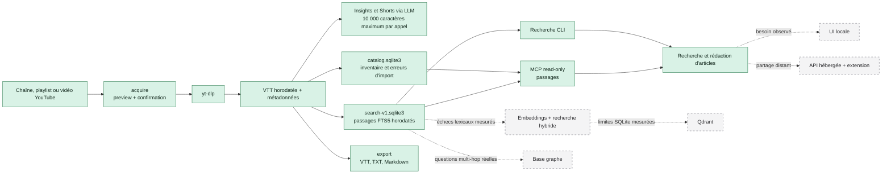

# État d'implémentation

- **Mise à jour :** 2026-08-28
- **Candidat runtime :** `ba35104`
- **Validation locale :** 428 tests et 10 sous-tests réussis
- **Wheel :** installation minimale et extra MCP validés hors checkout, offline
- **Candidat global :** intégré au dépôt source global à `4d8a5a4`, 108 tests réussis, release inerte `b5b7e9de…`, aucune activation live
- **Routage implicite :** `FAIL`, 20/30 positifs, 0/15 activations interdites, p95 0,709 ms

YT Insights sait maintenant collecter des sous-titres YouTube, produire des
analyses avec un LLM, indexer tous les passages horodatés dans SQLite et rendre
cet index interrogeable depuis la CLI ou un client MCP.

## Vue d'ensemble

Les blocs pleins sont implémentés. Les blocs en pointillés restent
conditionnels ou non commencés.



## Ce qui est utilisable maintenant

| Surface | Usage | État vérifié |
|---|---|---|
| Collecte | Prévisualiser puis acquérir une vidéo, chaîne ou playlist | `acquire`; confirmation obligatoire pour les lots |
| Analyse | Produire insights, conseils, outils, citations et rapport agrégé | Implémenté avec cc-bridge, Ollama, Anthropic ou endpoint compatible |
| Shorts | Identifier trois passages et télécharger le segment choisi | Implémenté |
| Catalogue | Inventorier vidéos, sources, artefacts et erreurs d'import | Implémenté dans `catalog.sqlite3` |
| Recherche de passages | Retrouver un extrait VTT, son timestamp et son lien YouTube | Implémenté dans `search-v1.sqlite3` |
| Export | Produire un VTT, TXT ou Markdown sourcé sans LLM | `export video`, publication atomique |
| Diagnostic | Vérifier dépendances, chemins et backends locaux sans secret ni écriture | `doctor --json` |
| Accès LLM | Interroger catalogue et passages depuis un client MCP | Quatre outils read-only implémentés |
| Corpus complet | Construire l'index de tous les VTT après contrôle disque | 3 270 documents et 183 789 passages validés localement |
| Installation | Installer le checkout et l'extra MCP | Wheel 0.2.0 testé hors du checkout |

`catalog.sqlite3` et `search-v1.sqlite3` répondent à deux besoins différents.
Le catalogue conserve l'inventaire opérationnel. L'index de recherche dérive
directement des VTT et conserve les passages horodatés. Aucun des deux ne doit
être utilisé comme substitut aux fichiers source.

## Ce qui reste à décider ou implémenter

| Évolution | Pourquoi elle n'est pas active | Gate avant développement |
|---|---|---|
| Revue humaine de la pertinence | La technique est validée, pas la qualité éditoriale des résultats | Juger les requêtes de l'artefact P2 et enregistrer `PASS` ou `FAIL` |
| Routage global Claude Code/Codex | Le benchmark réel atteint 20/30 positifs et 0/15 activations interdites | Corriger les confusions inter-skills et atteindre 27/30 sans baisser le seuil global |
| Installation globale | La source globale passe 108 tests, mais aucune release yt-insights n'est activée ni installée | Refaire l'inventaire après le drift Codex, générer les trois digests live puis attendre les approbations exactes |
| Découpage LLM des longs transcripts | Insights et Shorts utilisent actuellement les 10 000 premiers caractères | Mesurer les pertes sur des articles réels, puis définir chunking et fusion |
| MLX direct | `MLXBackend` existe mais le résolveur ne le sélectionne pas | Ajouter une option explicite et des tests sur Apple Silicon |
| UI locale | CLI et MCP couvrent déjà la recherche locale | Documenter une friction répétée lors de recherches réelles |
| Extension YouTube | Elle ajoute maintenance, permissions navigateur et sécurité | Confirmer qu'un envoi manuel par CLI ou MCP ralentit l'usage |
| Version hébergée | Elle impose authentification, isolation des corpus et exploitation | Besoin explicite de partage distant ou multi-utilisateur |
| Embeddings et recherche hybride | FTS5 suffit techniquement au corpus actuel | Mesurer des échecs sur synonymes, paraphrases ou recherche bilingue |
| Base graphe | Aucun besoin multi-hop n'est encore décrit par un cas réel | Nommer les questions impossibles à résoudre par passages et filtres |
| Qdrant | SQLite reste sous les budgets actuels | Adopter d'abord les embeddings, puis mesurer une limite de SQLite |

## Comment tester

### 1. Suite automatisée

Cette vérification ne contacte ni YouTube ni un LLM.

```bash
uv sync --extra mcp --extra dev
uv run --extra mcp --extra dev pytest -q
uv lock --check
git diff --check
```

Résultat observé sur le candidat runtime `ba35104` : `394 passed, 10 subtests passed`.

### 2. Tranche locale de 50 VTT

```bash
uv run yt-insights index --dry-run
uv run yt-insights index \
  --selection representative \
  --database /tmp/yt-insights-slice.sqlite3
uv run yt-insights search "context engineering" \
  --database /tmp/yt-insights-slice.sqlite3 \
  --limit 5
```

La première commande ne crée aucun fichier. Les deux suivantes construisent un
index dérivé dans `/tmp`, puis affichent des passages avec timestamps et liens
YouTube.

### 3. Corpus complet et benchmark

```bash
uv run yt-insights index \
  --corpus-root output \
  --database /tmp/yt-insights-full.sqlite3 \
  --all
uv run yt-insights index \
  --database /tmp/yt-insights-full.sqlite3 \
  --status
uv run python scripts/benchmark_search.py \
  --database /tmp/yt-insights-full.sqlite3 \
  --warmup 1 \
  --repeats 20 \
  --limit 10
```

La mesure de référence sur la machine de développement est un build en 48,75 s
et un p95 chaud de 13,81 ms. La pertinence humaine reste `UNKNOWN` malgré ces
résultats techniques.

### 4. MCP et packaging

```bash
uv run --extra mcp pytest -q tests/test_mcp_server.py
.venv/bin/python scripts/smoke_wheel.py --offline
```

Le premier test ouvre un vrai client MCP en mémoire. Le smoke construit un
wheel depuis une copie propre, teste l'installation sans MCP, puis avec l'extra
MCP. Il exécute `doctor`, `acquire --dry-run`, `export`, `index`, `search`,
l'entrypoint stdio et exactement quatre outils MCP.

## Documents associés

- [Installation locale](../INSTALL.md)
- [Roadmap produit](../ROADMAP.md)
- [Plan consolidé](../plans/2026-08-27-CONSOLIDATED-v2.md)
- [Architecture Claude Code et Codex](../plans/specs/AGENT-PLATFORM.md)
- [Plan runtime agentique](../plans/2026-08-28-09-agent-ready-runtime.md)
- [Plan intégration globale](../plans/2026-08-28-10-claude-codex-global-integration.md)
- [Plan hébergé et extension](../plans/2026-08-28-11-hosted-extension.md)
- [Preuve du corpus complet](../plans/evidence/2026-08-28-full-corpus-benchmark.md)
- [Artefact de revue humaine P2](../plans/evidence/2026-08-28-p2-50-vtt-evaluation.md)
