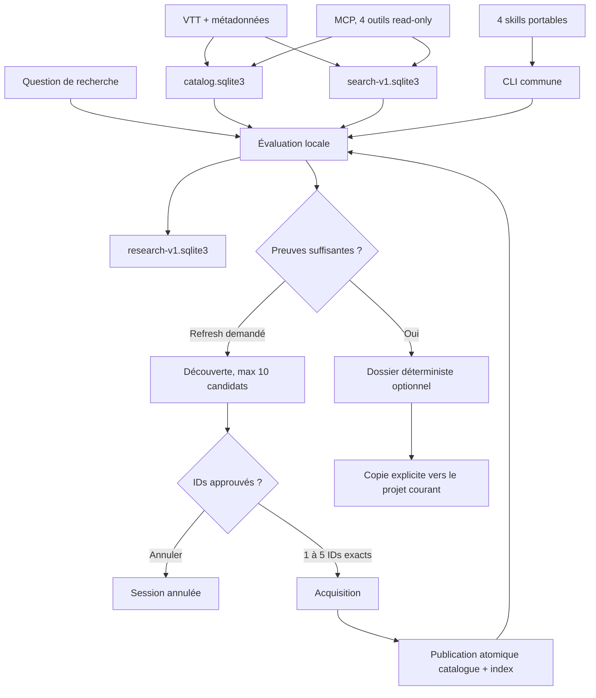

# État d'implémentation

**Mise à jour :** 2026-08-31

**Workflow cumulatif :** implémenté localement, vérification finale en cours

**Activation globale :** `false`

**GitHub CI :** absente

Le dernier résultat combiné connu avant la finalisation Task 10 est
`799 passed, 10 subtests passed`. Ce nombre est intermédiaire. Le coordinateur
doit publier le résultat au SHA final.

## Vue d'ensemble



Source reproductible :
[`docs/assets/cumulative-research-workflow.mmd`](assets/cumulative-research-workflow.mmd).
Le JPG du README reste inchangé car sa source de génération n'est pas suivie.

## Ce qui fonctionne

| Surface | Comportement implémenté | Limite |
|---|---|---|
| Acquisition | VTT et métadonnées, preview et confirmation des lots | Pas de transcription audio |
| Évaluation locale | Couverture, dates inconnues et fraîcheur par fingerprint exact | Aucun accès réseau, ne décide jamais que le corpus suffit |
| Sessions | État, révisions, événements, tentatives et résultats par vidéo dans `research-v1.sqlite3` | `status --json` expose `attempt_id`, statut, `error_code` et `source_sha256`, sans transcript |
| Découverte | Recherche YouTube par métadonnées après `refresh` | Maximum 10 candidats, aucune acquisition implicite |
| Approbation | IDs vérifiés contre le dernier snapshot | 1 à 5 IDs exacts |
| Acquisition cumulative | Résultats par vidéo, refresh unique, réévaluation | Les sources acquises restent en cas d'échec de publication |
| Retry | Reprend seulement le stage retryable enregistré | Un lot partiel ne réacquiert pas les vidéos déjà réussies |
| Dossier | `dossier.md` et `manifest.json` déterministes | Destination absolue, pas de prose LLM ni de réindexation |
| MCP | `list_corpora`, `search_videos`, `search_passages`, `get_passage` | Lecture seule |
| Assistants | Quatre skills projet et assets wheel Claude Code/Codex | Quatrième skill non installé globalement |
| Setup | `--dry-run`, `--apply`, `--verify`, plus `--assets-only` | Une écriture globale demande toujours une transaction approuvée |

## Cycle utilisateur

```text
start -> awaiting_sufficiency_confirmation
  -> sufficient -> completed -> optional export
  -> refresh -> discovering -> discover -> awaiting_candidate_approval
     -> cancel
     -> approve exact IDs -> acquire -> reindex -> reassess
        -> awaiting_sufficiency_confirmation
```

Chaque cycle d'évaluation se termine par la question de suffisance. `refresh`
autorise uniquement la découverte. L'utilisateur choisit ensuite séparément
les candidats à acquérir.

## Les quatre couches

| Donnée | Source ou dérivé | Ne doit jamais contenir |
|---|---|---|
| VTT et métadonnées | Source YouTube locale | Dossier généré |
| `catalog.sqlite3` | Inventaire dérivé | Passages de preuve comme source de recherche |
| `.search/search-v1.sqlite3` | FTS5 dérivé des VTT | Texte de dossier ou article |
| `.research/research-v1.sqlite3` | Historique opérationnel | Transcript complet, cookie ou secret |

## Gates observées

| Gate | Statut | Preuve |
|---|---|---|
| Pertinence | `UNKNOWN` | Le packet représentatif a retourné 0 résultat, donc aucun des 20 jugements requis |
| Découverte | `PASS` | 3 sujets sur 3, 10 candidats par sujet, corpus et bases inchangés |
| Refresh | `PASS` | 5 builds, p95 `47.122951 s`, 3 332 documents, 184 636 passages |
| YouTube live final | `UNKNOWN` | Pas de canari live dans la vérification hermétique |
| Claude Code frais | `UNKNOWN` | Chargement statique seulement |
| Codex frais | `UNKNOWN` | Chargement statique seulement |
| Activation globale | `false` | Pas de promotion du quatrième skill ou du runtime |

Les statuts `UNKNOWN` bloquent les affirmations de qualité et l'activation
globale. Ils ne bloquent pas une acquisition locale explicitement approuvée.

## Comment tester

### Suite locale

```bash
uv sync --extra mcp --extra dev
uv run --extra mcp --extra dev pytest -q
uv run --extra dev ruff check src tests scripts
uv run --extra dev mypy src
uv lock --check
git diff --check
```

Ces commandes ne prouvent ni YouTube live ni le chargement effectif dans une
session Claude Code ou Codex fraîche.

### Contrat de recherche

```bash
uv run pytest -q \
  tests/research \
  tests/test_cli_research.py \
  tests/test_cumulative_research_gates.py \
  tests/test_agent_assets.py \
  tests/test_assistant_setup.py
```

### Gates et wheel installable

```bash
uv run python scripts/validate_cumulative_research_gates.py \
  plans/evidence/2026-08-31-cumulative-research-gates.json
.venv/bin/python scripts/smoke_wheel.py --offline
```

Le smoke construit le wheel depuis une copie propre, installe le quatrième
skill dans un HOME temporaire, vérifie les dix sous-commandes `research`, puis
teste les quatre outils MCP read-only. Les exécutables Claude et Codex factices
ne doivent pas être invoqués par `--assets-only`.

## Non livré

Interface web, extension navigateur, API hébergée, MCP writable, recherche
vectorielle ou hybride, base graphe et acquisition automatique restent hors du
produit actuel. Leurs déclencheurs sont définis dans la
[roadmap](../ROADMAP.md).

## Documents associés

- [Installation](../INSTALL.md)
- [Roadmap](../ROADMAP.md)
- [Guide Claude Code et Codex](claude-code.md)
- [Gates mesurées](../plans/evidence/2026-08-31-cumulative-research-gates.md)
- [Spécification](superpowers/specs/2026-08-31-cumulative-research-workflow-design.md)
- [Plan d'implémentation](superpowers/plans/2026-08-31-cumulative-research-workflow.md)
