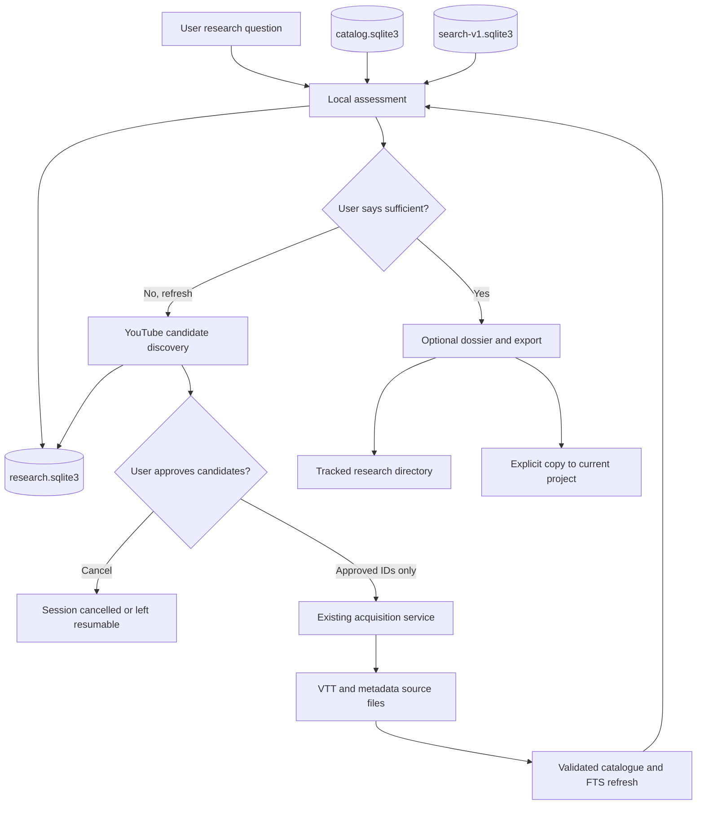
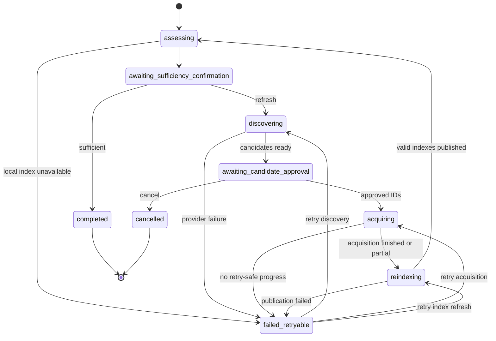

# Cumulative YouTube Research Workflow Design

**Status:** Proposed for review  
**Date:** 2026-08-31  
**Scope:** Local-first assisted research workflow for yt-insights  
**Primary interface:** `yt-insights research` CLI, reused by Claude Code and Codex

## 1. Goal

Turn yt-insights from a read-only corpus search tool into an assisted research
workflow that improves its local knowledge over time.

For every research request, the system must:

1. search the existing local catalogue and timestamped passage index;
2. report objective coverage and freshness evidence;
3. ask the user whether the available material is sufficient;
4. if the user asks for a refresh, discover new YouTube candidates without
   downloading them;
5. ask the user which candidates to acquire;
6. acquire only the explicitly approved candidates;
7. refresh the catalogue and passage index;
8. run the assessment again and ask whether the material is now sufficient;
9. optionally produce a versioned research dossier and export it to the current
   project.

The workflow records every research session in a local operational database.
The YouTube source catalogue grows only when the user approves new source
acquisition. Generated dossiers never become YouTube source material.

## 2. Current Boundary

The repository already provides the required lower-level primitives:

- deterministic local FTS5 passage search with timestamps and canonical
  YouTube links;
- a SQLite video catalogue with canonical video IDs, source associations,
  artefact hashes, import runs, and durable errors;
- acquisition previews and explicit confirmation for videos, playlists,
  channels, and batches;
- staged catalogue and search-index publication with validation and rollback;
- deterministic transcript exports;
- a four-tool read-only MCP server;
- portable Claude Code and Codex skills for acquisition, read-only research,
  and export.

The following capabilities do not exist yet:

- topic-based YouTube discovery;
- local coverage and freshness assessment;
- a persistent research-session state machine;
- candidate review and approval;
- an orchestrated acquire, refresh, and reassess loop;
- a canonical versioned research dossier.

The new workflow must compose existing application functions. It must not put
research orchestration inside the existing MCP server, catalogue module, or
acquisition module.

## 3. Design Decision

Implement a first-class `yt-insights research` application service and CLI.
Claude Code, Codex, and a future web application consume the same stable
machine-readable contract.

Rejected alternatives:

| Alternative | Reason for rejection |
| --- | --- |
| Prompt-only orchestration | Non-deterministic behavior, no durable resume, and avoidable Claude/Codex divergence |
| Writable MCP as the first interface | Tool permission and confirmation semantics are harder to secure and test than a CLI state machine |
| Extending the catalogue schema with research state | Couples operational research history to the immutable-source inventory and increases migration risk |
| Indexing generated dossiers as source passages | Creates self-citation and provenance confusion |

The existing MCP remains read-only. Network access and corpus mutations remain
in the main Claude Code or Codex session through the packaged CLI.

## 4. Architecture



### 4.1 Module boundaries

Create a focused `src/yt_insights/research/` package:

| Module | Responsibility | Must not do |
| --- | --- | --- |
| `models.py` | Stable enums and immutable domain values | Open files, databases, or the network |
| `assessment.py` | Calculate objective local coverage and freshness | Decide that coverage is sufficient |
| `store.py` | Own `research.sqlite3`, state transitions, revisions, and events | Read or mutate catalogue internals |
| `discovery.py` | Provider protocol, candidate normalization, deduplication, and bounded diversity | Acquire videos or write source files |
| `workflow.py` | Orchestrate assessment, decisions, discovery, acquisition, refresh, and reassessment | Implement provider or database internals |
| `dossier.py` | Render versioned Markdown and JSON manifests | Add generated prose to source indexes |

Only the CLI adapter imports the workflow service. Existing catalogue,
acquisition, search, export, and MCP modules keep their current ownership.

## 5. User Flow and CLI Contract

### 5.1 Start a session

```console
yt-insights research start "Local AI inference cost optimization" \
  --query "local LLM inference cost" \
  --query "MLX versus Ollama performance" \
  --freshness-profile fast \
  --json
```

If no `--query` is provided, the topic is the sole retrieval query. Assistants
may propose several explicit queries, but every exact query is persisted and
shown in the assessment. Hidden query expansion is forbidden.

Version 1 accepts one to eight queries. Topic and query strings contain at most
500 Unicode characters after trimming. Empty, duplicate-normalized, or
control-character input fails before network or corpus access.

The command performs local reads, records the session, and returns
`awaiting_sufficiency_confirmation`. It does not access the network.

### 5.2 Inspect and resume

```console
yt-insights research status SESSION_ID --json
yt-insights research decide SESSION_ID sufficient --revision N \
  --idempotency-key KEY --json
yt-insights research decide SESSION_ID refresh --revision N \
  --idempotency-key KEY --json
```

`sufficient` completes the evidence-collection loop. `refresh` authorizes
network discovery only. It does not authorize acquisition.

### 5.3 Review candidates

```console
yt-insights research candidates SESSION_ID --json
yt-insights research approve SESSION_ID VIDEO_ID VIDEO_ID --revision N \
  --idempotency-key KEY --json
yt-insights research cancel SESSION_ID --revision N \
  --idempotency-key KEY --json
```

The workflow returns at most ten candidates. `approve` accepts at most five
distinct video IDs from the latest candidate snapshot. Unknown, stale, or
duplicate IDs fail closed.

Approval authorizes acquisition of those exact video IDs. It does not authorize
playlist, channel, related-video, or recursive acquisition.

### 5.4 Retry and export

```console
yt-insights research retry SESSION_ID --revision N --idempotency-key KEY --json
yt-insights research export SESSION_ID --output research/TOPIC/DATE-SESSION \
  --json
```

`retry` repeats only the failed retryable transition. It never replays an
already committed decision or successfully acquired video.

Human-readable output ends every assessment cycle with a direct question. JSON
output never attempts an interactive prompt. It exposes the state and a stable
`required_user_action` value so the calling assistant can ask the question.

## 6. Assessment Contract

An assessment reports evidence. It never decides sufficiency.

Required fields:

```json
{
  "schema_version": 1,
  "session_id": "019...",
  "revision": 1,
  "topic": "Local AI inference cost optimization",
  "queries": ["local LLM inference cost"],
  "freshness": {
    "profile": "fast",
    "maximum_age_days": 14,
    "last_successful_discovery_at": null,
    "stale": true,
    "reason": "never_checked"
  },
  "coverage": {
    "matched_passages": 20,
    "matched_videos": 8,
    "distinct_channels": 4,
    "queries_with_zero_hits": [],
    "newest_source_published_at": "2026-08-24",
    "unknown_publication_date_count": 1
  },
  "state": "awaiting_sufficiency_confirmation",
  "required_user_action": "confirm_sufficiency_or_refresh"
}
```

The implementation may add fields in a later schema version. It may not remove,
rename, or change the meaning of version 1 fields.

Coverage counts use the bounded result snapshots stored for the session, not
global catalogue counts. The assessment stores the selected passage IDs,
bounded excerpts, source artifact hashes, video IDs, ranks, filters, query
result limits, and opaque database-generation identities needed to reproduce
the diagnostic.
Each query stores at most twenty passage hits and twenty video hits. Counts in
the assessment are unique across all query snapshots by passage ID and video ID.

The reader captures the catalogue and search database identities before the
first query and validates them again after the last query. If either immutable
database was replaced during assessment, the assessment fails retryably rather
than combining generations.

`distinct_channels` counts only canonical channel IDs present on timestamped
passage evidence. Catalogue-only results may contribute to `matched_videos` and
publication-date metrics, but a source slug is never presented as a channel
identity. `unknown_publication_date_count` applies to the bounded catalogue
video snapshot. These evidence boundaries are included in the response and
dossier manifest.

Unknown dates remain unknown. They are never treated as recent.

## 7. Freshness Policy

Freshness is specific to an exact discovery fingerprint, not to the catalogue
as a whole.

The fingerprint is the SHA-256 of canonical JSON containing:

- normalized topic text;
- the ordered, normalized explicit query list;
- requested languages;
- discovery-provider name and contract version.

This conservative identity avoids claiming that a related but different search
was recently refreshed. Topic aliases and semantic fingerprint merging are out
of scope for version 1.

Profiles are deterministic:

| Profile | Maximum age | Intended use |
| --- | ---: | --- |
| `fast` | 14 days | Models, tools, APIs, pricing, and rapidly changing practices |
| `standard` | 30 days | Current engineering and product practices |
| `stable` | 90 days | Methods and experience reports |
| `historical` | No forced refresh | Historical and foundational material |

If no profile is provided, use `standard`. An assistant may suggest another
profile, but must show it to the user and preserve the explicit selection.

For profiles with a maximum age, freshness is based on the last successful
discovery run for the exact fingerprint. A recent source publication does not
prove that YouTube was recently checked. A missing successful run produces
`stale=true` with `reason=never_checked`.

The `historical` profile always returns `stale=false` with
`reason=refresh_not_required`, while still reporting the last discovery date
when one exists.

Freshness never bypasses the sufficiency question. The user is asked on every
assessment cycle, even when the session is fresh and coverage is broad.

## 8. Session State Machine



Each mutation requires the expected session revision. The store executes
`BEGIN IMMEDIATE`, validates the current state and revision, records the domain
change and event in one transaction, then increments the revision. A stale
caller receives a conflict and must fetch `status` again.

Decisions have an idempotency key derived from session ID, expected revision,
action, and canonical action payload. Repeating a committed decision returns
the committed result without applying it twice.

An acquisition command also carries an explicit idempotency key. The store
reserves one durable acquisition attempt before network access, persists each
item outcome under that attempt, and returns the existing attempt when the same
key and payload are replayed. Immutable transcript promotion and cached-source
detection make a crash between download and outcome persistence retry-safe.

## 9. Research Database

`research.sqlite3` is a separate, versioned operational database under the
configured data root. It is gitignored.

Configuration adds an explicit research-database path derived from the data
root and an optional absolute canonical dossier root. The CLI never infers the
dossier repository from its current working directory. When the canonical root
is unset, `research export` requires `--output`. Repository setup may configure
the yt-insights checkout's tracked `research/` directory as that canonical root.

Version 1 owns these tables:

| Table | Purpose |
| --- | --- |
| `schema_meta` | Exact schema version |
| `research_sessions` | Topic, fingerprint, profile, state, revision, retry target, timestamps, and terminal status |
| `research_queries` | Ordered exact retrieval and discovery queries |
| `research_assessments` | Immutable bounded diagnostic snapshots |
| `research_candidates` | Provider snapshot, original rank, normalized metadata, and candidate status |
| `research_decisions` | User-approved action and canonical payload |
| `research_acquisition_attempts` | Durable idempotency identity, revision, status, and batch metadata |
| `research_acquisition_outcomes` | Per-video status, bounded error code, and source artifact hash |
| `research_events` | Append-only transition and error history |

The database stores no transcript body, cookies, API keys, model credentials,
or copied dossier prose. Candidate descriptions are bounded and treated as
untrusted external text.

Every research request creates a session record, even if the user immediately
accepts the local corpus. The source catalogue grows only after candidate
approval and successful acquisition.

When a transition enters `failed_retryable`, the session records the exact
retry target and bounded failure code. `retry` may enter only that target. A
caller cannot choose a different transition through the retry command.

## 10. Discovery Provider

Define a provider protocol returning a bounded `DiscoveryResult` with candidates,
provider identity, query-level errors, and completion status.

The first implementation is a local experimental yt-dlp provider because the
dependency already exists and requires no API secret. It is not a compliance
claim. A public or hosted product must use an approved YouTube Data API adapter
after reviewing terms, quota, retention, and attribution requirements.

Provider behavior:

- maximum ten normalized candidates per session cycle;
- canonical video ID as identity;
- exclude IDs already present in the source catalogue;
- retain the provider's original rank;
- apply deterministic round-robin channel diversity after deduplication;
- expose title, channel, publication date, watch URL, matching query, and
  original rank when available;
- never claim transcript availability before acquisition proves it;
- preserve partial errors instead of converting them into an empty success.

Discovery writes only research-session state. Candidate preview must leave the
corpus, catalogue, and passage index byte-identical.

## 11. Acquisition and Index Refresh

The workflow converts approved candidate IDs into exact single-video acquisition
plans and calls the existing acquisition service. It does not reimplement
downloading, transcript language selection, path confinement, or index
publication.

Per-cycle rules:

- accept one to five exact candidate video IDs;
- snapshot the accepted candidates before acquiring;
- acquire each video independently;
- record `acquired`, `no_transcript`, `already_present`, or `failed_retryable`;
- refresh the catalogue and passage index once after the batch;
- reassess even when only part of the batch succeeds;
- ask the sufficiency question again.

Acquired source files are immutable inputs and are not deleted when a later
index refresh fails. Existing validated databases remain the active pair. The
session records the failed refresh and can resume from `reindexing`.

The acquisition service must expose a structured per-video outcome so the
workflow never classifies free-form diagnostics. A failed search-index
publication after catalogue publication must restore both the previous search
index and the previous catalogue before returning failure. Pair rollback is
validated before the session becomes retryable.

The store persists the whole batch transition atomically, including per-video
outcomes and source hashes. Explicit store operations cover
`acquiring -> reindexing`, `reindexing -> assessing`, latest-assessment reads,
and immutable session-history reads used by status and dossier export.

Before claiming the interactive loop is performance-validated, measure five
full-corpus refreshes. If p95 exceeds 60 seconds on the reference local corpus,
the CLI reports a bounded performance warning and incremental refresh becomes a
prerequisite for global activation, not for an explicitly approved local batch.

## 12. Versioned Dossiers and Project Export

Canonical completed dossiers use this tracked layout:

```text
research/<topic-slug>/<YYYY-MM-DD>-<session-id>/
├── dossier.md
└── manifest.json
```

`manifest.json` contains:

- schema version and yt-insights version;
- session ID, topic, queries, languages, and freshness profile;
- assessment timestamps and user decisions;
- selected video IDs and source artefact hashes;
- evidence passage IDs, timestamped URLs, and ranks;
- acquisition failures and unresolved coverage limits;
- generation backend identity when a model produced derived prose.

`dossier.md` clearly separates source-backed findings, derived synthesis,
contradictions, coverage limits, and unresolved questions. Every quoted or
source-backed evidence item links to a manifest evidence reference.

The dossier is not automatically generated after the sufficiency decision.
The assistant asks whether the user wants a dossier, an article draft, a corpus
export, both, or no additional output.

`research export` implements only the deterministic dossier. After an explicit
choice, the main assistant session may use that dossier to draft an article and
may call the existing exact-video exporter for selected source transcripts.
Those assistant outputs remain outside the deterministic research CLI contract
and require explicit destination paths.

Copying a dossier into the current Claude Code or Codex project is an explicit
export. Existing files are never overwritten without `--force`. Absolute local
paths are not written into tracked manifests.

## 13. Claude Code and Codex Integration

Keep the existing `youtube-research` skill and native corpus researcher strictly
read-only. Add a separate portable skill for the cumulative workflow after the
CLI contract is stable.

The new skill:

- is invoked in the main session because it may require network and writes;
- calls `yt-insights research` instead of reproducing its logic;
- interprets `required_user_action` and always asks the corresponding question;
- never converts `refresh` into acquisition approval;
- never approves candidates on behalf of the user;
- preserves source-backed output requirements;
- keeps all versioned prompts and examples in English.

Global installation remains a separate digest-approved release operation. A
fresh Claude Code session and a fresh Codex session must demonstrate the same
state transitions before global activation is considered complete.

## 14. Error Handling and Recovery

| Failure | Required behavior |
| --- | --- |
| Missing or invalid local index | Record a failed retryable session without an assessment and provide the rebuild command |
| Empty local results | Persist zero coverage and still ask whether to refresh |
| Unknown publication dates | Count separately and never treat as current |
| Discovery provider unavailable | Record bounded error and enter `failed_retryable` |
| Partial provider response | Preserve candidates and errors, then allow review |
| Candidate disappears | Mark failed without substituting another video |
| Transcript unavailable | Record `no_transcript`, continue other approved IDs |
| Duplicate decision | Return the prior result without replaying side effects |
| Concurrent stale decision | Reject revision and require status refresh |
| Index publication failure | Keep prior valid databases, retain acquired sources, and allow retry |
| Dossier path exists | Fail unless explicit `--force` is supplied |

Errors exposed to assistants must not include cookies, credentials, unsafe local
paths, URL user information, query parameters containing secrets, or raw external
exception payloads.

## 15. Testing Strategy

All implementation tasks follow RED, GREEN, REFACTOR. Tests are not deferred
until after implementation.

### 15.1 Unit tests

- freshness profile boundaries and exact-date behavior;
- discovery fingerprint determinism;
- objective assessment counts and unknown dates;
- every valid and invalid state transition;
- revision conflicts and decision idempotency;
- candidate deduplication and channel diversity;
- dossier manifest determinism and path safety.

### 15.2 Integration tests

- temporary catalogue, search index, and research database;
- no network or source-corpus, catalogue, or search-index mutation during local
  assessment; only research-session state may change;
- fake discovery provider with success, partial, empty, and failure results;
- exact approved-ID acquisition through a fake acquisition adapter;
- transcript-unavailable and partial-batch recovery;
- valid old database pair retained after simulated refresh failure;
- retry resumes the failed transition only;
- generated dossier never appears in source search results.

### 15.3 CLI contract tests

- stable JSON schemas and bounded payloads;
- human output contains the required question for every assessment cycle;
- JSON output contains `required_user_action` and never blocks for input;
- unknown session, stale revision, stale candidate snapshot, and invalid ID fail
  closed;
- existing CLI commands remain behaviorally unchanged.

### 15.4 Real-system gates

- the existing complete test suite passes from a clean isolated worktree;
- exactly twenty top-five results across at least three real subjects receive a
  human relevance judgment;
- relevance passes at 16/20 or higher before retrieval quality is marked
  validated; exact user-approved local acquisition remains available while the
  gate is `UNKNOWN` or `FAIL`;
- three no-write topic discovery probes return at least five plausible distinct
  candidates per subject, or the local provider is rejected;
- five full-corpus refresh measurements determine whether incremental indexing
  is required;
- fresh Claude Code and Codex sessions replay the same recorded scenario.

Network probes and human judgments are evidence gates, not hermetic CI tests.

## 16. Delivery Sequence and Parallel Ownership

After the version 1 models and JSON contract are frozen, three implementation
streams can proceed in parallel without touching the same files:

| Stream | Owned implementation | Owned tests |
| --- | --- | --- |
| Assessment | `research/assessment.py` | `tests/research/test_assessment.py` |
| Store | `research/store.py` | `tests/research/test_store.py` |
| Discovery | `research/discovery.py` | `tests/research/test_discovery.py` |

The coordinator exclusively owns `research/models.py`, CLI wiring, shared
fixtures, integration order, and schema changes. Acquisition integration starts
only after all three streams are merged and their contracts pass.

Dossier rendering may proceed in parallel with acquisition integration once the
session and evidence schemas are stable. Claude Code, Codex, and documentation
updates begin only after the CLI schema is frozen.

Each stream uses an isolated worktree and one scoped commit. No stream stages or
reverts unrelated files.

## 17. Acceptance Criteria

The implementation is complete when all of these conditions hold:

- every research start records a durable session;
- local assessment performs no network access;
- every assessment cycle ends in `awaiting_sufficiency_confirmation`;
- freshness uses the exact discovery fingerprint and explicit profile;
- `refresh` authorizes discovery only;
- candidate preview changes no corpus or source index bytes;
- no more than ten candidates are presented per cycle;
- only one to five explicitly approved video IDs are acquired;
- repeated decisions and resumes are idempotent;
- partial acquisition and refresh failures are recoverable;
- reassessment and the sufficiency question occur after every acquisition cycle;
- source catalogue and generated dossier provenance remain separate;
- versioned dossiers contain no absolute local paths or secrets;
- existing tests and all new tests pass;
- gate artifacts report `PASS`, `FAIL`, or `UNKNOWN` without changing the
  explicit approval boundaries.

Global activation is complete only when the human relevance gate reaches at
least 16/20, refresh performance is measured, discovery probes pass, and fresh
Claude Code and Codex sessions demonstrate the same workflow.

## 18. Explicitly Deferred Work

| Deferred capability | Trigger required before design starts |
| --- | --- |
| YouTube Data API provider | Hosted use, or more than 10 percent local-provider failure across 30 recorded discovery runs |
| Incremental index refresh | Full refresh p95 above 60 seconds across five measured runs |
| Writable MCP | Repeated CLI friction documented in at least five real assistant sessions |
| Web interface | At least ten successful research sessions plus a confirmed remote sharing need |
| Browser extension | Manual URL submission blocks at least ten recorded uses |
| Vector or hybrid retrieval | Human relevance below 80 percent after lexical tuning on the frozen evaluation set |
| Graph database | At least three confirmed relationship queries cannot be answered from passages and catalogue metadata |
| Automatic acquisition mode | At least twenty assisted cycles with no incorrect approval and a separate explicit opt-in design |
| Automatic ranking self-learning | At least fifty human candidate decisions and a reproducible offline evaluation protocol |

These triggers authorize a new design discussion. They do not authorize silent
activation or implementation.

## 19. Rollback and Compatibility

- The first phases add a new package, command group, and separate database.
- Existing catalogue, search, acquisition, export, and MCP schemas remain
  unchanged.
- Each phase is one revertible commit.
- Reverting a phase restores the previous CLI while leaving immutable acquired
  VTT source files usable by existing commands.
- Old code ignores `research.sqlite3` and tracked dossiers.
- No migration deletes research history. Unsupported schema versions fail
  closed with an actionable message.
- A phase rollback must take less than five minutes and must not require corpus
  deletion.
