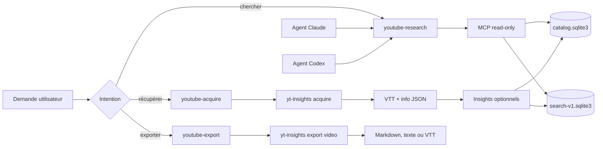

# Architecture Claude Code et Codex pour yt-insights

**Date :** 2026-08-28  
**Statut :** design consolidé après revue d'architecture  
**Périmètre :** usage personnel global sur cette machine, depuis n'importe quel dépôt  
**Hypothèse de vocabulaire :** « Cloud » dans la demande désigne Claude Code. La voie vers un service hébergé reste documentée séparément.

## Résultat attendu

Depuis une session Claude Code ou Codex, l'utilisateur peut formuler ces demandes sans connaître les commandes internes :

1. « Trouve dans mon corpus les passages sur les agents fiables. »
2. « Récupère le transcript de cette vidéo. »
3. « Ajoute cette chaîne au corpus pour 2025 et 2026. »
4. « Exporte cette vidéo en Markdown pour préparer un article. »

La recherche passe par un MCP local en lecture seule. L'acquisition et l'export passent par une CLI installée globalement. Les skills décrivent le workflow et les agents isolent les recherches longues. Les hooks ne réimplémentent aucune logique produit.

## État observé au 2026-08-28

- La CLI, l'index FTS5 complet et le MCP à deux outils fonctionnent dans le dépôt.
- Le MCP utilise encore un chemin de base relatif par défaut.
- Le dépôt contient cinq skills, un agent et un hook propres à Claude Code.
- Ces skills appellent parfois `yt-dlp` directement, supposent une langue ou un répertoire courant, et dupliquent des règles présentes dans la CLI.
- Codex charge déjà les skills personnels depuis `~/.agents/skills`, les agents personnels depuis `~/.codex/agents`, les hooks depuis `~/.codex/hooks.json` ou `config.toml`, et les MCP depuis `~/.codex/config.toml`.
- La configuration globale partagée est publiée sous forme de releases immuables depuis `~/.config/ai-agents` avec approbation liée à un digest.

## Décisions

### Une seule logique exécutable

La CLI `yt-insights` porte la classification des sources, les chemins, les contrôles de volume, l'acquisition, les exports et les diagnostics. Un skill ne contient ni pipeline `yt-dlp` alternatif, ni logique de déduplication, ni règle de sélection de backend.

### Un répertoire de données explicite

La configuration ajoute `data_root`. Les chemins dérivés sont :

```text
data_root/
├── catalog.sqlite3
├── .search/search-v1.sqlite3
├── transcripts/              # boîte d'arrivée historique pour une vidéo isolée
├── insights/
├── exports/
└── <channel-slug>/
    ├── transcripts/
    ├── insights/
    └── INDEX.md
```

Ordre de résolution : option CLI explicite, variable `YT_INSIGHTS_DATA_ROOT`, fichier `~/.config/yt-insights/config.toml`, puis `output/` pour préserver la compatibilité du dépôt.

### Une façade d'acquisition sûre

`yt-insights acquire` devient la commande utilisée par les agents. Elle classe la source en `video`, `playlist`, `channel` ou `batch`, puis produit un aperçu avant mutation.

- Une vidéo isolée peut être acquise sans confirmation supplémentaire lorsqu'elle correspond à la demande explicite de l'utilisateur.
- Une chaîne, une playlist ou un batch calcule le volume, le dossier cible et la fenêtre de dates, puis exige `--yes` pour commencer.
- Une relance est idempotente par défaut.
- Les cookies navigateur ne sont jamais ajoutés automatiquement. L'utilisateur choisit explicitement le navigateur après un échec documenté.
- La commande ne supprime pas de piste de langue. Une future commande de normalisation pourra archiver les doublons après validation séparée.

### Un export source-first

`yt-insights export video` produit `vtt`, `txt` ou `md`. Le Markdown conserve le titre, la chaîne, l'identifiant vidéo, l'URL YouTube et les timestamps. Aucun résumé LLM n'est nécessaire pour exporter la matière source.

Un export de dossier multi-vidéos reste hors du premier lot. Il dépend d'un article réel et de son angle, conformément à la roadmap existante.

### MCP en lecture seule

Le serveur conserve sa frontière locale et ajoute seulement les outils nécessaires à la découverte :

| Outil | Effet | Limite |
|---|---|---|
| `list_corpora` | Liste les chaînes et les comptes disponibles | 100 lignes, aucun chemin absolu |
| `search_videos` | Recherche titres et insights du catalogue | 20 résultats |
| `search_passages` | Recherche les passages horodatés | 20 résultats |
| `get_passage` | Lit un passage identifié | 1 500 caractères |

Le MCP n'acquiert pas de vidéo, n'écrit pas d'export, n'expose pas SQL et ne lance pas de shell. Claude Code et Codex utilisent le même exécutable et la même base absolue.

### Trois skills communs

| Skill | Déclencheurs principaux | Autorisation |
|---|---|---|
| `youtube-acquire` | récupérer, télécharger, ajouter une vidéo, chaîne ou playlist | réseau et écriture locale selon la demande |
| `youtube-research` | chercher, comparer, trouver un passage ou une source | MCP en lecture seule |
| `youtube-export` | exporter un transcript ou préparer une matière source | lecture du corpus et écriture du fichier demandé |

Les descriptions couvrent les formulations françaises et anglaises utiles sans attirer les demandes de développement d'un lecteur YouTube ou d'une interface vidéo.

### Deux agents spécialisés

- Claude Code reçoit `youtube-corpus-researcher.md`. Il précharge `youtube-research`, utilise le MCP `yt-insights` et reste centré sur la recherche sourcée.
- Codex reçoit `youtube_corpus_researcher.toml`. Il utilise un sandbox `read-only` et hérite du MCP. Il ne sert pas à l'acquisition.

L'acquisition reste dans la session principale, car elle nécessite parfois une permission réseau, une écriture hors du dépôt courant et une confirmation de volume.

### Pas de deuxième hook global

La machine possède déjà un routeur de skills global sur `UserPromptSubmit`. Les nouveaux skills rejoignent son index et ses évaluations. Ajouter un second hook YouTube créerait deux routes concurrentes et deux sources de règles.

Le hook local `.claude/hooks/yt-channel-router.sh` reste actif jusqu'à ce que les tests de nouvelles sessions atteignent les deux critères suivants :

- au moins 27 bonnes routes sur 30 prompts positifs ;
- aucune activation sur 15 prompts négatifs liés au développement vidéo, au SEO YouTube ou à une simple discussion sur une vidéo.

Après réussite, une modification séparée retire le hook local et son entrée dans `.claude/settings.json`.

### Installation globale transactionnelle

L'installation suit trois transactions approuvées séparément :

1. `yt-runtime` installe le wheel vérifié, active ses deux entrypoints et écrit `~/.config/yt-insights/config.toml` avec un `data_root` absolu après `GO INSTALL YT RUNTIME <digest>` ;
2. `shared` publie la release immuable contenant les trois skills après `GO INSTALL SHARED <digest>` ;
3. `yt-integrations` installe les deux agents et les deux configurations MCP après `GO INSTALL YT INTEGRATIONS <digest>`.

Les trois candidats sont construits et testés sans écriture dans les cibles
globales, puis leurs diffs expurgés et digests sont présentés dans un tour qui
s'arrête avant installation. Chaque transaction possède ses préimages, son
journal et son rollback. Les MCP et la CLI lisent le même `data_root` absolu.
Un test depuis deux répertoires courants distincts doit retrouver le même corpus.

Une approbation générique ne suffit pas. Chaque écriture vérifie que les hashes des préimages globales n'ont pas changé depuis la préparation.

## Flux cible



## Backend local ou distant

`yt-insights doctor --json` expose les backends disponibles sans imprimer de secret. L'ordre automatique reste compatible avec le résolveur actuel, mais le choix explicite gagne toujours.

| Usage | Route recommandée | Raison |
|---|---|---|
| recherche et export | aucun LLM | déterministe et immédiat |
| acquisition de transcripts | aucun LLM | `yt-dlp` suffit |
| extraction en volume | Ollama ou cc-bridge local | coût maîtrisé |
| extraction ponctuelle à exigence éditoriale élevée | backend distant explicite | choix assumé par l'utilisateur |
| MLX direct | expérimentation après réparation du backend | l'adaptateur présent ne charge pas encore de modèle explicitement |

La transcription audio n'entre pas dans ce plan. Elle sert seulement lorsque YouTube ne fournit aucun sous-titre exploitable.

## Critères d'acceptation

Le socle est accepté lorsque :

1. `yt-insights doctor --json` fonctionne depuis un répertoire sans rapport avec le dépôt et ne révèle aucun secret ;
2. `yt-insights acquire --dry-run` classe correctement une vidéo, une chaîne, une playlist et un batch ;
3. une chaîne ne démarre pas sans `--yes` après l'aperçu ;
4. `yt-insights export video` produit les trois formats avec provenance ;
5. le MCP expose exactement quatre outils read-only et utilise une base absolue ;
6. Claude Code et Codex trouvent le même passage pour cinq requêtes de contrôle ;
7. les trois skills passent les tests de routage positifs et négatifs ;
8. les deux agents restent en lecture seule pour la recherche ;
9. les canaris Claude Code et Codex prouvent qu'ils ne peuvent ni écrire, ni acquérir, ni exporter ;
10. la CLI retrouve le même corpus depuis deux répertoires courants sans variable manuelle ;
11. les trois transactions globales refusent une préimage modifiée ou un digest incorrect ;
12. chaque rollback restaure les hashes précédents ;
13. la suite Python, le smoke wheel et les validations de la release globale passent.

## Voie hébergée conditionnelle

Une extension navigateur ou un accès depuis plusieurs machines exige un service
distant. La première version mono-utilisateur conserve le corpus filesystem et
SQLite sur un volume persistant avec un seul worker d'écriture. PostgreSQL et
le stockage objet arrivent seulement avec la concurrence ou le multi-utilisateur.

Elle démarre seulement si l'un de ces faits est observé :

- au moins dix envois manuels de vidéos par semaine pendant deux semaines ;
- besoin d'accéder au corpus depuis une seconde machine ;
- besoin de partager un dossier avec une autre personne ;
- impossibilité répétée d'utiliser la CLI ou le MCP local depuis le navigateur.

Sans ce signal, le fonctionnement local Claude Code et Codex reste le produit prioritaire.
